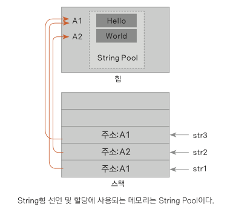
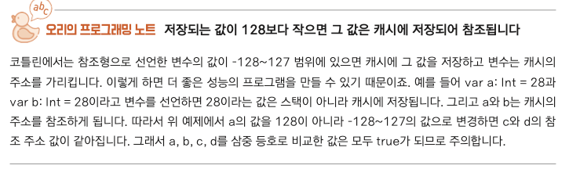

### val var const
런타임 보다는 컴파일 타임에 변수가 상수임을 나타내야 한다.

**val**
- 실행 시간(런타임)에 val 키워드를 사용한다. (java final)

**const**
- 컴파일 상수(컴파일 시점)에 const 변경자를 사용한다.
- const 는 private inline 같은 변경자 - 무조건 val 과 같이 쓰임

**var**
- 변수를 선언하더라도 초기값을 변경 가능

### String 저장 방식

* 코틀린은 힙 영역에 String Pool 이라는 공간에 문자열을 저장해둠
* 만약 같은 문자열을 참조하게 되면 String Pool 공간에 이미 있는 문자열을 참조함
```kotlin
fun main() {
    val a = "hello"
    val b = "hello"
    
    print(a === b) // true
}
```

### 널체크
### 널 체크

```kotlin
var str1: String?
```

- str1?.length - str1을 세이프 콜로 안전하게 호출
- str1!!.length - NPE 강제 발생
- str1 ?: “0”

```kotlin
str1?.length ?: -1

if (str1 != null) str1.length else -1

// 두개가 같음
```

### 기본형과 참조형 비교
### 기본형과 참조형 자료형의 비교

== : 단순 값만 비교

=== : 참조 주소 비교

```kotlin
// Int는 기본형으로 변환후 저장
val a: Int = 128
val b: Int = 128 println(a == b) // true 
println(a === b) // true

// Int는 위처럼 기본형으로 저장
// Int?는 참조형으로 저장
val a: Int = 128
val b: Int? = 128 println(a == b) // true 
println(a === b) // false
```

```kotlin
val a: Int = 128
val b = a
println(a === b)
val c: Int? = a
val d: Int? = a
val e: Int? = c
println(c == d)
println(c === d)
println(c === e)
// 답: true, true, false, true

val a: Int = 28
val b = a
println(a === b)
val c: Int? = a
val d: Int? = a
val e: Int? = c
println(c == d)
println(c === d)
println(c === e)
// 답: true, true, true, true
```


### 스마트 캐스트
- Number
- Any
  - 자료형이 정해지지 않은 경우에 사용

### 자료형 검사기
```kotlin
// true, false 발생
num is Int

// as는 형변환이 가능하지 않으면 예외발생
val x: String = y as String

// y가 null이 아니면 String으로 형변환되어 x에 할당
val x: String? = y as? String
```