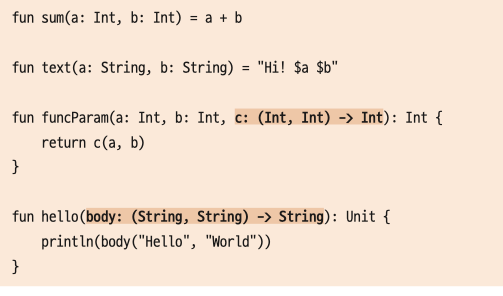
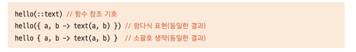

```kotlin
val multi = {x: Int, y: Int -> x * y} // 일반 변수에 람다식 할당
val multi2: (Int, Int) -> Int = {x: Int, y: Int -> x * y}

result = multi(10, 20) // 람다식이 할당된 변수는 함수처럼 사용 가능
```

다 같은 표현

```kotlin
val multi: (Int, Int) -> Int = {x: Int, y: Int -> x * y}
val multi = {x: Int, y: Int -> x * y}
val multi: (Int, Int) -> Int = {x, y -> x * y}
```


### 람다식과 고차함수 호출
```kotlin
fun main( ) {
 val result = callByValue(lambda( )) // 람다식 함수를 호출
 println(result)
}
fun callByValue(b: Boolean): Boolean { // 일반 변수 자료형으로 선언된 매개변수
 println("callByValue function")
 return b
}
val lambda: ( ) -> Boolean = { // 람다 표현식이 2줄
 println("lambda function")
 true // 마지막 표현식 문장의 결과가 반환
}
```

```kotlin
fun main( ) {
 val result = callByName(otherLambda) // 람다식 이름으로 호출
 println(result)
}
fun callByName(b: ( ) -> Boolean): Boolean { // 람다식 자료형으로 선언된 매개변수
 println("callByName function")
 return b( )
}
val otherLambda: ( ) -> Boolean = {
 println("otherLambda function")
 true
}
```

- lambda() 를 하면 람다식을 즉시 실행
- 하지만 otherLambda를 실행시키면 return b() 여기서 실행
- ⇒ 즉시 실행할 필요가 없는 코드를 작성하는 경우 이름에 의한 호출방법을 통해 필요할 때만 람다식이 작동하도록 할 수 있다.

### 다른 함수의 참조에 의한 일반 함수 호출

```kotlin
fun sum(x: Int, y: Int) = x + y

funcParam(3, 2, sum) // sum은 람다식이 아님

// 하지만 sum()과 funcParam()의 매개변수 c의 선언부 인자수와 개수가 동일

funcParam(3, 2, ::sum) // 사용 가능
```





위처럼 표현 가능

- 매개변수가 1개인 경우에는 화살표 표기를 생략하고 $it으로 대체할 수 있습니다.
