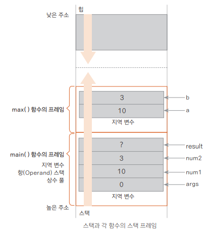

### 함수 선언하고 호출하기

**함수란?**
- 여러 값(인자) 입력받아 기능을 수행하고 결괏값을 반환하는 코드의 모음


**함수의 구조 자세히 살펴보기**
```kotlin
fun sum(a: Int, b: Int): Int {
    var sum = a + b
    return sum
}
```
```kotlin
fun 함수 이름([변수 이름: 자료형, 변수 이름: 자료형..]): [반환값의 자료형] {
    표현식...
    [return 반환값]
}
```
sum 함수 최종적으로 줄이기
```kotlin
fun sum(a: Int, b: Int) = a + b
```
<br>

**함수 호출과 프로그램의 실행 순서**
```kotlin
fun sum(a: Int, b: Int): Int {
    var sum = a + b
    return sum
}

fun main( ) {
    val result1 = sum(3, 2)
    val result2 = sum(6, 7)
    
    println(result1)
    println(result2)
}
```
1. 프로그램의 진입점 main() 함수
2. 함수의 호출과 함수의 인자
3. sum() 함수 호출

> 인자? 매개변수?
> 
> 인자 : 함수를 호출할 때 > sum(3, 2)
> 
> 매개변수 : 함수를 선언할 때 > sum(a: Int, b: Int) 

<br>

**함수의 호출과 메모리**
```kotlin
fun main() { // 최초의 스택 프레임
    val num1 = 10 // 임시 변수 혹은 지역 변수
    val num2 = 3 // 임시 변수 혹은 지역 변수
    val result: Int

    result = max(num1, num2) // 두 번째 스택 프레임
    println(result)
}

fun max(a: Int, b: Int) = if (a > b) a else b // a와 b는 max( ) 함수의 임시 변수
```



*그냥 먼저 실행 시킨 함수가 먼저 소멸된다...!*

<br>

**반환값이 없는 함수**
```kotlin
fun printSum(a: Int, b: Int): Unit {
    println("sum of $a and $b is ${a + b}")
}
```
- 반환값의 자료형을 생략할 수 있으나 실제로는 반환값의 자료형이 Unit임을 항상 기억

**매개변수 제대로 활용하기**

매개변수의 개수가 고정되지 않은 함수 사용하기
```kotlin
fun normalVarargs(vararg counts: Int) {
    for (num in counts) {
        print("$num ")
    }
    print("\n")
}
```
