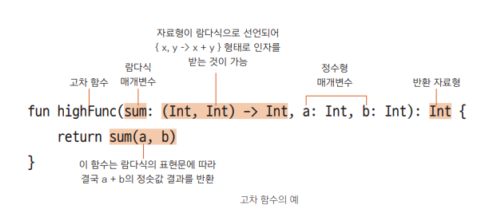

### 함수형 프로그래밍

코틀린은 다중 패러다임 언어이다
- 다중 패러다임 언어
  - 함수형 프로그래밍 + 객체 지향 프로그래밍
  - 한 가지 구현 규칙에 얽매이지 않고 다양한 문법과 형식을 지원


**함수형 프로그래밍이란?**
- 순수 함수를 작성하여 프로그램의 부작용을 줄이는 프로그래밍 기법
- 람다식과 고차 함수 사용


- 순수 함수
  - 부작용이 없는 함수 : 어떤 함수가 같은 인자에 대하여 항상 같은 결과를 반환
  - 순수 함수 : 부작용이 없는 함수가 함수 외부의 어떤 상태도 바꾸지 않는다
  - ```kotlin
    // 순수 함수의 예
    fun sum(a: Int, b: Int): Int {
      return a + b // 동일한 인자인 a, b를 입력받아 항상 a + b를 출력(부작용이 없음)
    }
    ```
<br>

- 람다식
  - `{ x, y -> x + y } // 람다식의 예(이름이 없는 함수)`
  - 수학에서 말하는 람다 대수는 이름이 없는 함수로 2개 이상의 입력을 1개의 출력으로 단순화 하는 개념

<br>

- 일급 객체 (값으로 전달할 수 있는 객체)
  - 함수형 프로그래밍에서는 함수를 일급 객체로 생각
  - 일급 객체의 특징
    - 일급 객체는 함수의 인자로 전달할 수 있다
    - 일급 객체는 함수의 반환값에 사용할 수 있다
    - 일급 객체는 변수에 담을 수 있다
  - 람다식은 일급 객체의 특성을 가지고 있다

> kotlin의 함수는 1급 객체라고 할 수 있으나 <br>
> java의 함수는 위 조건을 만족하지 못하기 때문에 1급 객체라고 하지 못한다

<br>

- 고차 함수
  - 다른 함수를 인자로 사용
  - 함수를 결괏값으로 반환
  - ```kotlin
      // 고차 함수의 예
      fun main( ) {
          println(highFunc({ x, y -> x + y }, 10, 20)) // 람다식 함수를 인자로 넘김
      }
      fun highFunc(sum: (Int, Int) -> Int, a: Int, b: Int): Int = sum(a, b) // sum 매개변수는 함수
      ```
  - 


> 함수형 프로그래밍의 정의와 특징<br>
> • 순수 함수를 사용해야 한다.<br>
> • 람다식을 사용할 수 있다.<br>
> • 고차 함수를 사용할 수 있다.