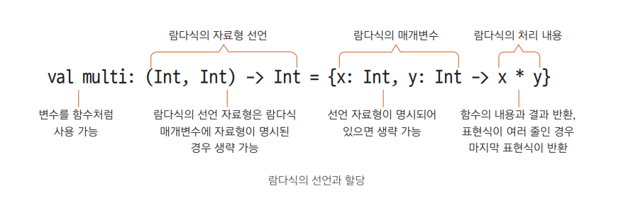
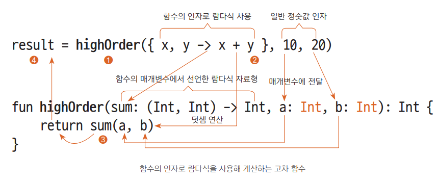
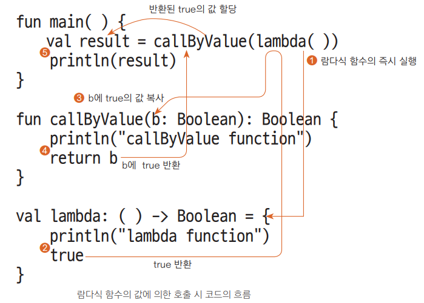
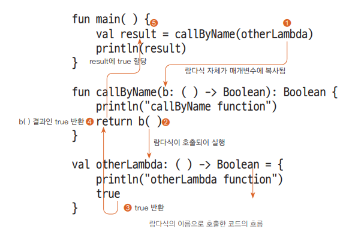

### 고차 함수와 람다식

**고차 함수의 형태**

- 일반 함수를 인자나 반환값으로 사용하는 고차 함수
  - 인자에 일반 함수 사용
    ```kotlin
    fun main() {
        val res1 = sum(3, 2) // 일반 인자
        val res2 = mul(sum(3, 3), 3) // 인자에 함수를 사용

        println("res1: $res1, res2: $res2")
    }
    fun sum(a: Int, b: Int) = a + b
    fun mul(a: Int, b: Int) = a * b

    ```
  - 반환값에 일반 함수 사용
    ```kotlin
    fun main() {
        println("funcFunc: ${ funcFunc() }")
    }

    fun sum(a: Int, b: Int) = a + b
    fun funcFunc() = sum(2, 2) // 함수의 반환값으로 함수 사용
    ```
- 람다식을 인자나 반환 값으로 사용하는 고차 함수
  - 변수에 할당하는 람다식 함수 작성하기
  ```kotlin
  fun main() {
    val result: Int
    val multi = { x: Int, y: Int -> x * y } // 일반 변수에 람다식 할당
    result = multi(10, 20) // 람다식이 할당된 변수는 함수처럼 사용 가능
    println(result)
  }
  ```
  
  - 매개변수에 람다식 함수를 이용한 고차 함수
  ```kotlin
  fun main() {
    val result = highOrder({ x, y -> x + y }, 10, 20)
    println(result)
  }

  fun highOrder(sum: (Int, Int) -> Int, a: Int, b: Int): Int {
    return sum(a, b)
  }
  ```
  
  - 인자와 반환값이 없는 람다식 함수
  ```kotlin
  fun main() {
    val out: () -> Unit = { println("Hello World!") } // 인자와 반환값이 없는 람다식의 선언
    // 자료형 추론이 가능하므로 val out = { println("Hello World!") } 와 같이 생략 가능

    out() // 함수처럼 사용 가능
    val new = out // 람다식이 들어있는 변수를 다른 변수에 할당
    new()
  }
  ```

<br>

**람다식과 고차 함수 호출하기**<br>
함수의 내용을 할당, 인자, 반환값을 자유롭게 넘기려면 호출 방법을 이해해야한다
- 기본형 변수 / 값에 의한 호출(Call by Value)
  - 기본형 변수로 할당된 값은 스택에 있다
  - 다른 함수에 인자를 전달하는 경우 해당 값이 복사되어 전달
- 참조형 변수 / 참조에 의한 호출(Call by Reference)
  - 참조형 변수로 할당된 객체는 참조 주소가 스택에 있고 객체는 힙에 있다
  - 다른 함수에 인자를 전달하는 경우 참조된 주소가 복사되어 전달

- 값에 의한 호출
  - 값에 의한 호출로 람다식 사용하기
  ```kotlin
  fun main() {

    val result = callByValue(lambda()) // 람다식 함수를 호출
    println(result)

  }

  fun callByValue(b: Boolean): Boolean { // 일반 변수 자료형으로 선언된 매개변수
    println("callByValue function")
    return b
  }
  
  val lambda = { // 람다 표현식이 2줄 (타입 선언 생략, 책에는 나옴)
    println("lambda function")
    true // 마지막 표현식 문장의 결과가 반환
    
    // jvm 에서 기본형으로 컴파일되서 값에 의한 호출이라고 한건가?
    // 이해가 되질 않아요...ㅠㅜ
  }
  ```
  
  - 결과 값 
- 이름에 의한 람다식 호출
  - 람다식 이름을 사용해 호출하기
  ```kotlin
  fun main( ) {
    val result = callByName(otherLambda) // 람다식 이름으로 호출
    println(result)
  }

  fun callByName(b: () -> Boolean): Boolean { // 람다식 자료형으로 선언된 매개변수
    println("callByName function")
    return b()
  }
  
  val otherLambda = {
    println("otherLambda function")
    true
  }
  ```
  
- 다른 함수의 참조에 의한 일반 함수 호출
  - 참조에 의한 호출 방식으로 일반 함수 호출하기
  ```kotlin
  fun main( ) {
    // ① 인자와 반환값이 있는 함수
    // 선언부의 람다 함수가 인자수와 자료형의 개수가 동일하면
    // 콜론 2개를 이용해 소괄호와 인자를 생략하고 사용 가능
    val res1 = funcParam(3, 2, ::sumFun)
    println(res1)

    // ② 인자가 없는 함수
    hello(::text) // 반환값이 없음

    // ③ 일반 변수에 값처럼 할당
    val likeLambda = ::sumFun
    println(likeLambda(6,6))
  }
  
  fun sumFun(a: Int, b: Int) = a + b
  
  fun text(a: String, b: String) = "Hi! $a $b"
  
  fun funcParam(a: Int, b: Int, c: (Int, Int) -> Int): Int {
    return c(a, b)
  }
  
  fun hello(body: (String, String) -> String): Unit {
    println(body("Hello", "World"))
  }
  ```
  - 콜론 2개를(::) 이용한 표기법 정리
    - `hello(::text)` : 함수 참조 기호
    - `hello({ a, b -> text(a, b) })` : 람다식 표현(동일한 결과)
    - `hello { a, b -> text(a, b) }` : 소괄호 생략(동일한 결과)

<br>

**람다식의 매개변수**
```kotlin
fun main( ) {
    // 매개변수 없는 람다식
    noParam({ "Hello World!" })
    noParam { "Hello World!" } // 위와 동일 결과, 소괄호 생략 가능

    // 매개변수가 1개 있는 람다식
    oneParam({ a -> "Hello World! $a" })
    oneParam { a -> "Hello World! $a" } // 위와 동일한 결과, 소괄호 생략 가능
    oneParam { "Hello World! $it" } // 위와 동일한 결과, it으로 대체 가능

    // 매개변수가 2개 있는 람다식
    moreParam { a, b -> "Hello World! $a $b"} // 매개변수 이름 생략 불가
    moreParam { _, b -> "Hello World! $b" } // 첫 번째 문자열은 사용하지 않고 생략

    // ① 인자와 함께 람다식을 사용하는 경우
    withArgs("Arg1", "Arg2", { a, b -> "Hello World! $a $b" })
    // ② withArgs( ) 함수의 마지막 인자가 람다식인 경우 소괄호 바깥으로 분리 가능
    withArgs("Arg1", "Arg2") { a, b -> "Hello World! $a $b" }
}

// 매개변수가 없는 람다식이 noParam 함수의 매개변수 out으로 지정됨
fun noParam(out: () -> String) = println(out())

// 매개변수가 1개 있는 람다식이 oneParam( ) 함수의 매개변수 out으로 지정됨
fun oneParam(out: (String) -> String) {
    println(out("OneParam"))
}

// 매개변수가 2개 있는 람다식의 moreParam 함수의 매개변수로 지정됨
fun moreParam(out: (String, String) -> String) {
    println(out("OneParam", "TwoParam"))
}

// withArgs( ) 함수는 일반 매개변수 2개를 포함, 람다식을 마지막 매개변수로 가짐
fun withArgs(a: String, b: String, out: (String, String) -> String) {
    println(out(a, b))
}
```
