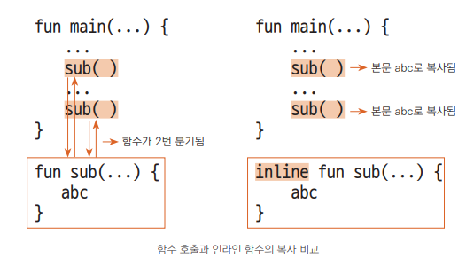

### 코틀린의 다양한 함수 알아보기

**익명함수**
- 함수 이름이 생략된 익명 함수
  - `fun(x: Int, y: Int): Int = x + y`
- 익명 함수를 사용한 add 선언
  - `val add: (Int, Int) -> Int = fun(x, y) = x + y`

<br>

**인라인 함수**
- 인라인 함수?
  - 이 함수가 호출되는 곳에 함수 본문의 내용을 모두 복사해 넣어 함수의 분기 없이 처리
  - 코드의 성능을 높일 수 있다
  - 코드가 복사되어 들어가기 때문에 내용은 대개 짧게 작성

- 앞 그림
  - 일반적인 함수의 호출 과정
  - 일반적인 함수는 함수가 호출될 때 마다 분기
- 뒷 그림
  - 인라인 함수의 호출 과정
  - 인라인 함수는 함수가 호출될 때 호출하는 함수의 블록 코드에 들어가브로 분기 없이 흐름에 방해하지 않고 코드가 수행
- 예제 코드
  ```kotlin
  fun main() {
    // 인라인 함수 shortFunc()의 내용이 복사되어 shortFunc으로 들어감
    shortFunc(3) { println("First call : $it") }
    shortFunc(5) { println("Second call : $it") }
  }
    
  inline fun shortFunc(a: Int, out: (Int) -> Unit) {
    println("Before calling out()")
    out(a)
    println("After calling out()")
  }
  ```
  - 자바로 디 컴파일 하게 되면 함수의 내용이 2번 복사된 것을 확인할 수 있다
- noinline 으로 람다식의 인라인 막기
  ```kotlin
  fun main( ) {
    shortFuncN(3) { println("First call: $it") }
  }
    
  inline fun shortFuncN(a: Int, noinline out: (Int) -> Unit) {
    println("Before calling out( )")
    out(a)
    println("After calling out( )")
  }
  ```
  - 자바로 디컴파일 하게 되면 out 부분이 복사되지 않은 것을 확인할 수 있다
- return 으로 람다식 빠져나오기
  ```kotlin
  fun main() {
    shortFuncL(3) {
        println("First call: $it")
        return // ①
    }
  }
    
  inline fun shortFuncL(a: Int, out: (Int) -> Unit) {
    println("Before calling out( )")
    out(a)
    println("After calling out( )") // ②
  }
  ```
  - out(a) 는 1번의 return 문까지 포함되기 때문에 After ... 문장이 실행되지 않는다 
  - 이러한 반환을 비지역 반환(Non-local Return) 이라고 부른다
- crossinline으로 비지역 반환 금지하기
  ```kotlin
  fun main() {
    shortFuncC(3) {
        println("First call: $it")
        // return 사용 불가
    }
  }
    
  inline fun shortFuncC(a: Int, crossinline out: (Int) -> Unit) {
    println("Before calling out( )")
    nestedFunc { out(a) }
    println("After calling out( )")
  }
    
  fun nestedFunc(body: () -> Unit) {
    body()
  }
  ```

<br>

**확장 함수**
- 확장함수 정의
  ```kotlin
  fun 확장 대상.함수 이름(매개변수, ...): 반환값 {
    ...
    return 값
  }
  ```
- String 클래스에 나만의 확장 함수 추가하기
  ```kotlin
  fun main() {
    val source = "Hello World!"
    val target = "Kotlin"
    println(source.getLongString(target))
  }
    
  // String 클래스를 확장해 getLongString( ) 함수 추가
  fun String.getLongString(target: String): String =
    if (this.length > target.length) this else target
  ```
  
<br>

**중위 함수**
- 중위 함수의 조건
  - 멤버 메서드 또는 확장 함수여야 한다
  - 하나의 매개변수를 가져야 한다
  - infix 키워드를 사용하여 정의한다
- 중위 함수를 이용해 연산자처럼 사용하기
  ```kotlin
  fun main() {
    // 일반 표현법
    // val multi = 3.multiply(10)
    
    // 중위 표현법
    val multi = 3 multiply 10
    println("multi: $multi")
  }
    
  // Int를 확장해서 multiply( ) 함수를 하나 더 추가함
  infix fun Int.multiply(x: Int): Int { // infix로 선언되므로 중위 함수
    return this * x
  }
  ```
  - 연산자 처럼 표현 가능

<br>

**꼬리 재귀 함수**
- 재귀 함수의 조건
  - 무한 호출에 빠지지 않도록 탈출 조건을 만들어 둔다
  - 스택 영역을 이용하므로 호출 휫수를 무리하게 많이 지정해 연산하지 않는다
  - 코드를 복잡하지 않게 한다
- 일반적인 팩토리얼의 재귀 함수 만들기
  ```kotlin
  fun main() {
    val number = 4
    val result: Long = factorial(number)
    println("Factorial: $number -> $result")
  }
    
  fun factorial(n: Int): Long {
    return if (n == 1) n.toLong() else n * factorial(n - 1)
  }
  ```
- 꼬리 재귀를 사용해 팩토리얼 만들어 보기
  ```kotlin
  fun main() {
    val number = 5
    println("FactorialL $number -> ${ tailFactorial(number) }")
  }
    
  tailrec fun tailFactorial(n: Int, run: Int = 1): Long {
    return if (n ==1 ) run.toLong() else tailFactorial(n - 1, run * n)
  }
  ```
- 피보나치 수열을 꼬리 재귀로 만들기
  ```kotlin
  fun main() {
    val n = 100
    val first = BigInteger("0")
    val second = BigInteger("1")

    println(fibonacci(n, first, second))
  }
    
  tailrec fun fibonacci(n: Int, a: BigInteger, b: BigInteger): BigInteger {
    return if (n == 0) a else fibonacci(n - 1, b, a)
  }
  ```
  
