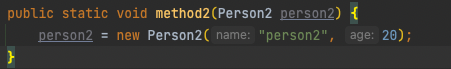
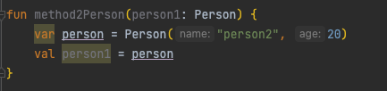
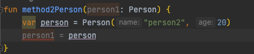

do it kotlin에서 이런말이 있었는데 혼란스러워 정리를 해보려고 합니다.

참조형 객체는 함수에 전달할 때는 참조된 주소가 복사되어 전달됩니다.
JVM에서 실행되는 자바나 코틀린은 함수를 호출할 때 인자의 값만 복사하는 ‘값의 의한 호출 (Call by Value)’이 일반적입니다. C/C++에서 사용하는 포인터 주소 연산이 없기 때문에 주소 자체를 사용해 호출하는 ‘참조에 의한 호출(Call by Reference)’은 자바나 코틀린에서 사용되 지 않습니다. 자바는 객체가 전달될 때 주소 자체를 전달하는 것이 아닌 값을 복사하는데 이 것은 참조에 의한 호출처럼 보이지만 그 값이 주소일 뿐입니다.

~~사실 자바나 코틀린은 call by reference를 사용하는줄…알았네요..~~

자바는 call by value라고 합니다.

- 함수 호출 시 전달되는 변수의 값을 복사하여 함수의 인자로 전달한다.
- 복사된 인자는 함수 안에서 지역적으로 사용되는 local value 이다.
- 그래서 함수 안에서 인자의 값은 변해도, 외부의 변수 값은 변경되지 않는다.

```kotlin
fun method1() {
    val a = 10
    val b = 20
    println("before method2 = $a $b")
    method2(a, b)
    println("after method2 = $a $b")
}

fun method2(a: Int, b: Int) {
    var a = a
    var b = b
    a = 20
    b = 10
    println("method2 = $a $b")
}

fun main() {
    method1()
}
// 결과값
// before method2 = 10 20
// method2 = 20 10
// after method2 = 10 20
```

```kotlin
fun method1() {
    val person1 = Person("person1", 10)
    println("before method2 = ${person1.name} ${person1.age}")
    method2(person1)
    println("after method2 = ${person1.name} ${person1.age}")
}

fun method2(person1: Person) {
    var person = person1
    person.age = 20
    person.name = "person2"
    println("method2 = ${person1.name} ${person1.age}")
}

fun main() {
    method1()
}

// 결과값
// before method2 = person1 10
// method2 = person2 20
// after method2 = person2 20
```

call by value라면 변하지 않았을것 같은데 변했다…?

int일 경우에는

- 자바와 코틀리넹서는 값을 복사하여 새로운 지역 변수에 저장한다.
- 때문에 기존 a, b에 영향이 가지 않는다.
- 새로운 지역 변수는 다른 주소이기 때문에 기존 a, b에 영향이 가지 않는다.

person일 경우에는

- 객체는 힙에 저장되며 참조타입이다.
- 참조타입은 주소를 사용하기 위해서 만들어진것!
- 즉 method1 → method2 넘겨주는것은 person의 주소값

그렇다면 새로운 객체를 만들어서 기존 person에 넣는다면?


ide가 표현해주듯이 기존 person2에 넣어도 새로운 객체 즉 새로운 주소값이 들어가므로 참조를 하지 않는다.
코틀린도 마찬가지이다.




만약 call by refence를 사용했다면?

- 주소값을 넘겨서 그 주소값에 새로운 객체를 넣을 수도 있었을지도?
- Int같은 경우에도 값을 바로 바꿀 수도 있었을지도??
- 이렇게 보면 call by value가 더 안전한것 같기도 하다.

Reference
[https://velog.io/@ahnick/Java-Call-by-Value-Call-by-Reference](https://velog.io/@ahnick/Java-Call-by-Value-Call-by-Reference)