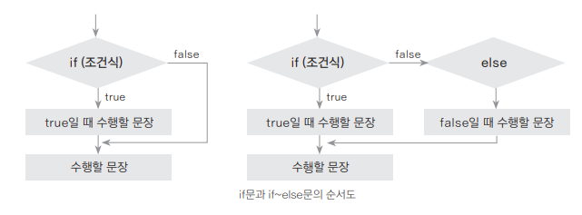
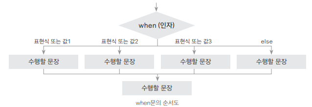

### 조건문

**if문과 if~else문**

- 구성
  ```kotlin
  if (조건식) {
    수행할 문장 // 조건식이 true인 경우에만 수행
    ...
  } else {
    수행할 문장 // 조건식이 false인 경우에만 수행
    ...
  }
  ```
- 블록의 표현식이 길어질 때
  - 조건문의 표현식 사용해보기
  ```kotlin
  fun main( ) {
    val a = 12
    val b = 7
    
    // 블록과 함께 사용
    val max = if (a > b) {
        println("a 선택")
        a // 마지막 식인 a가 반환되어 max에 할당
    }
    else {
        println("b 선택")
        b // 마지막 식인 b가 반환되어 max에 할당
    }
    
    println(max)
  }
  ```

<br>

**in 연산자와 범위 연산자로 조건식 간략하게 만들기**
- 구성 : `변수 이름 in 시작값..마지막값`
  ```kotlin
  if (score >= 90) {
    grade = 'A'
  } else if (score in 80.0..89.9) {
    grade = 'B'
  } else if (score in 70.0..79.9) {
    grade = 'C'
  }
  ```

**인자를 사용하는 when문**

- 구성
  ```kotlin
  when (인자) {
    인자에 일치하는 값 혹은 표현식 -> 수행할 문장
    인자에 일치하는 범위 -> 수행할 문장
    ...
    else -> 수행할 문장
  }
  ```
- when문에 함수의 반환값을 사용할 수 있다
- is 키워드를 함께 사용할 수 있다
- 인자 없이 사용할 수 있다 (조건식을 구성해서 사용할 수 있다)
- 다양한 자료형의 인자를 받을 수 있다