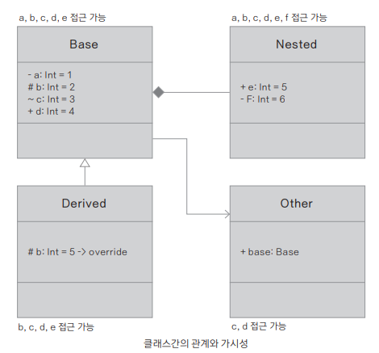

## 정보 은닉 캡슐화

### 가시성 지시자
- 가시성
  - 각 클래스나 메서드, 프로퍼티의 접근 범위를 가시성(Visibility)이라고 한다
  - 코틀린의 가시성 지시자(Visibility Modifier)들
    - private: 이 요소는 외부에서 접근할 수 없다.
    - public: 이 요소는 어디서든 접근이 가능하다(기본값).
    - protected: 외부에서 접근할 수 없으나 하위 상속 요소에서는 가능하다.
    - internal: 같은 정의의 모듈 내부에서는 접근이 가능하다.
  - 위치
    - [가시성 지시자] <val | var> 전역 변수 이름
    - [가시성 지시자] fun 함수 이름( ) { ... }
    - [가시성 지시자] [특정 키워드] class 클래스 이름 [가시성 지시자] constructor(매개변수) {
      - [가시성 지시자] constructor( ) { ... }
      - [가시성 지시자] 프로퍼티
      - [가시성 지시자] 메서드
    - }
  - 접근 범위
  

**private**
```kotlin
private class PrivateClass {
    private var i = 1
    
    private fun privateFunc() {
        i += 1 // 접근 허용
    }
    
    fun access() {
        privateFunc() // 접근 허용
    }
}

class OtherClass {
    // val opc = PrivateClass() // 불가 - 프로퍼티 opc는 private이 되어야 함
    fun test() {
        val pc = PrivateClass() // 생성 가능
    }
}

fun main() {
    val pc = PrivateClass() // 생성 가능
    // pc.i // 접근 불가
    // pc.privateFunc() // 접근 불가
}

fun TopFunction() {
    val tpc = PrivateClass() // 객체 생성 가능
}
```

<br>

**protected**
```kotlin
open class Base { // 최상위 클래스에는 protected를 사용할 수 없음
    protected var i = 1

    protected fun protectedFunc() {
        i += 1 // 접근 허용
    }

    fun access() {
        protectedFunc() // 접근 허용
    }

    protected class Nested // 내부 클래스에는 지시자 허용
}

class Derived : Base() {
    fun test(base: Base): Int {
        protectedFunc() // Base 클래스의 메서드 접근 가능
        return i // Base 클래스의 프로퍼티 접근 가능
    }
}

fun main() {
    val base = Base() // 생성 가능
    // base.i // 접근 불가
    // base.protectedFunc() // 접근 불가
    base.access() // 접근 가능
}
```

<br>

**internal**
> **자바의 package 지시자** <br>
> 자바의 가시성 지시자 기본값인 package 지시자는 코틀린에서 사용하지 않는다
> 자바에서 package로 지정된 경우 접근 요소가 패키지 내부에 있다면 접근할 수 있다
> 하지만 프로젝트 단위 묶음의 .jar 파일이 달라져도 패키지 이름이 동일하면 다른 
> .jar에서도 접근할 수 있었기 때문에 보안 문제가 발생할 수 있었다
> 코틀린에서는 이것을 막고자 기존의 package를 버리고 internal로 
> 프로젝트의 같은 모듈(빌드된 하나의 묶음)이 아니면 외부에서 접근할 수 없게 했다
```kotlin
internal class InternalClass {
    internal var i = 1
    
    internal fun icFunc() {
        i += 1 // 접근 허용
    }
    
    fun access() {
        icFunc() // 접근 허용
    }
}
class Other {
    internal val ic = InternalClass() // 프로퍼티를 지정할 때 internal로 맞춰야 함
    // internal 말고 private 도 됨
    
    fun test() {
        ic.i // 접근 허용
        ic.icFunc() // 접근 허용
    }
}

fun main() {
    val mic = InternalClass() // 생성 가능
    mic.i // 접근 허용
    mic.icFunc() // 접근 허용
}
```
다른 파일
```kotlin
fun main( ) {
    val otheric = InternalClass()
    println(otheric.i)
    otheric.icFunc()
}
```

### 가시성 지시자와 클래스의 관계
- 기호
  - -: private
  - +: public
  - #: protected
  - ~: package



- 자동차와 도둑 예제

```kotlin
open class Car protected constructor(_year: Int, _model: String, _power: String, _wheel: String) { // ①

    private var year: Int = _year
    public var model: String = _model // public은 기본값이므로 생략 가능
    protected open var power: String = _power
    internal var wheel: String = _wheel

    protected fun start(key: Boolean) {
        if (key) println("Start the Engine!")
    }

    class Driver(_name: String, _license: String ) { // ②
        private var name: String = _name
        var license: String = _license // public
        internal fun driving() = println("[Driver] Driving() - $name")
    }
}

class Tico(_year: Int, _model: String, _power: String, _wheel: String, var name: String, private var key: Boolean)
    : Car(_year, _model, _power, _wheel) {

    override var power: String = "50hp"
    val driver = Driver(name, "first class")

    constructor(_name: String, _key: Boolean)
            : this(2014, "basic", "100hp", "normal", _name, _key) {
        name = _name
        key = _key
    }

    fun access(password: String) {
        if (password == "gotico") {
            println("----[Tico] access()---------")
            // super.year // ③ private 접근 불가
            println("super.model = ${super.model}") // public
            println("super.power = ${super.power}") // protected
            println("super.wheel = ${super.wheel}") // internal
            super.start(key) // protected
            // driver.name // private 접근 불가
            println("Driver().license = ${driver.license}") // public
            driver.driving() // internal
        } else {
            println("You're a burglar")
        }
    }
}

class Burglar() {
    fun steal(anycar: Any) {
        if (anycar is Tico) { // ④ 인자가 Tico의 객체일 때
            println("----[Burglar] steal()---------")
            // println(anycar.power) // protected 접근 불가
            // println(anycar.year) // private 접근 불가
            println("anycar.name = ${anycar.name}") // public 접근
            println("anycar.wheel = ${anycar.wheel}") // internal 접근 (같은 모듈 안에 있으므로)
            println("anycar.model = ${anycar.model}") // public 접근
            println(anycar.driver.license) // public 접근
            anycar.driver.driving() // internal 접근 (같은 모듈 안에 있으므로)
            // println(Car.start()) // protected 접근 불가
            anycar.access("dontknow")
        } else {
            println("Nothing to steal")
        }
    }
}
fun main() {
    // val car = Car() // protected 생성 불가
    val tico = Tico("kildong", true)
    tico.access("gotico")
    val burglar = Burglar()
    burglar.steal(tico)
}
```
```
----[Tico] access()---------
super.model = basic
super.power = 100hp
super.wheel = normal
Start the Engine!
Driver( ).license = first class
[Driver] Driving() - kildong
----[Burglar] steal()---------
anycar.name = kildong
anycar.wheel = normal
anycar.model = basic
first class
[Driver] Driving() - kildong
You're a burglar
```
