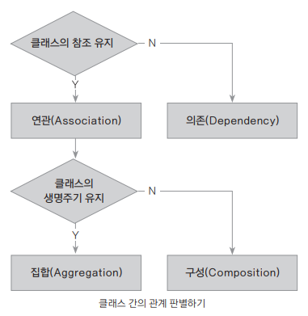
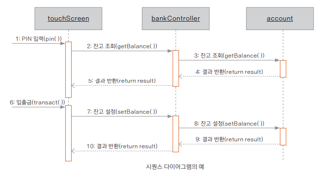

## 클래스와 클래스의 관계

### 클래스 혹은 객체 안의 관계


**연관 관계**
```kotlin
class Patient(val name: String) {
    fun doctorList(d: Doctor) { // 인자로 참조
        println("Patient: $name, Doctor: ${d.name}")
    }
}

class Doctor(val name: String) {
    fun patientList(p: Patient) { // 인자로 참조
        println("Doctor: $name, Patient: ${p.name}")
    }
}

fun main( ) {
    val doc1 = Doctor("KimSabu") // 객체가 따로 생성됨
    val patient1 = Patient("Kildong")
    doc1.patientList(patient1)
    patient1.doctorList(doc1)
}
```
- 서로 독립적인 생명 주기를 가지고 있다
- 두 클래스가 서로의 객체를 참조하고 있으므로 양방향 참조를 가지고 있다
- 단방향이든 양방향이든 각각의 객체의 생명주기에 영향을 주지 않을 때는 연관 관계이다

**의존 관계**
```kotlin
class Patient(val name: String, var id: Int) {
    fun doctorList(d: Doctor) {
        println("Patient: $name, Doctor: ${d.name}")
    }
}

class Doctor(val name: String, val p: Patient) {
    val customerId: Int = p.id
    fun patientList( ) {
        println("Doctor: $name, Patient: ${p.name}")
        println("Patient Id: $customerId")
    }
}

fun main( ) {
    val patient1 = Patient("Hannah", 1234)
    val doc1 = Doctor("ChaeMin", patient1)
    doc1.patientList( )
}
```
- 의존적인 생명 주기를 가지고 있다
- 각각의 객체의 생명주기에 영향을 주므로 의존 관계이다

**집합 관계**
```kotlin
// 여러 마리의 오리를 위한 List 매개변수
class Pond(_name: String, _members: MutableList<Duck>) {
    val name: String = _name
    val members: MutableList<Duck> = _members
    constructor(_name: String): this(_name, mutableListOf<Duck>( ))
}

class Duck(val name: String)

fun main( ) {
    // 두 개체는 서로 생명주기에 영향을 주지 않음
    val pond = Pond("myFavorite")
    val duck1 = Duck("Duck1")
    val duck2 = Duck("Duck2")

    // 연못에 오리를 추가 - 연못에 오리가 집합
    pond.members.add(duck1)
    pond.members.add(duck2)

    // 연못에 있는 오리들
    for (duck in pond.members) {
        println(duck.name)
    }
}
```
- 2개의 객체는 따로 생성되어 서로의 생명주기에 영향을 주지는 않는다
- 한 객체가 한 객체를 집합하고 있는 형태가 집합 관계이다

**구성 관계**
```kotlin
class Car(val name: String, val power: String) {
    private var engine = Engine(power) // Engine 클래스 객체는 Car에 의존적
    fun startEngine() = engine.start()
    fun stopEngine() = engine.stop()
}

class Engine(power: String) {
    fun start() = println("Engine has been started.")
    fun stop() = println("Engine has been stopped.")
}

fun main() {
    val car = Car("tico", "100hp")
    car.startEngine()
    car.stopEngine()
}
```
- 한 객체(Car)를 생성함과 동시에 한 객체(Engine)도 생성된다
- 한 객체(Engine)가 한 객체(Car)의 생명주기에 의존적이다

**객체 간의 메세지 전달하기**

