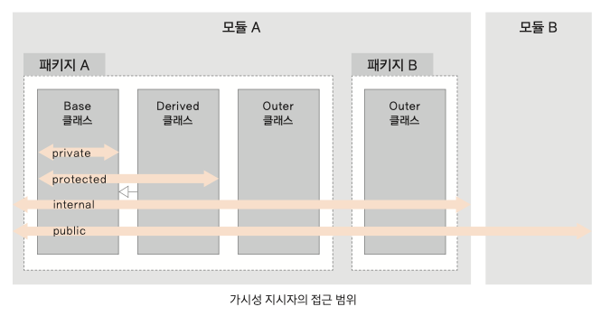

### 가시성 지시자 (private, public, protected, internal)

- 각 클래스나 메서드, 프로퍼티의 접근 범위를 가시성 이라고 한다.
- 클래스 생성자에 가시성 지시자가 있을 경우에는 constructor 생략 불가능

### internal

- 모듈 단위
- 자바의 package

자바에서는 .jar 파일이 달라져도 패키지 이름이 동일하면 다른 .jar에서도 접근할 수 있었기 때문에 보안 문제가 발생할 수 있음