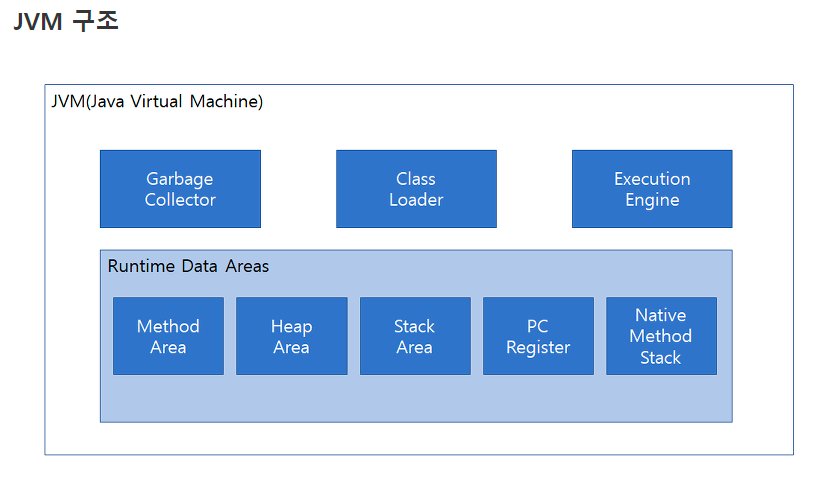
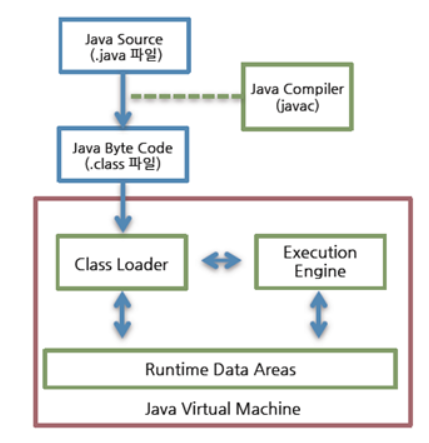

### 객체지향 프로그래밍의 배경
* 기존 절차지향 프로그래밍 - 유지보수가 너무 빡셈

### 그러면 객체지향이란?
* 애플리케이션에서 실제 세계를 모델링하여 프로그래밍하는 방법.
* 전에 말한 추상화를 통해서 필요한 데이터와 메서드들을 만들어 다른 객체들과 상호작용하여 프로그래밍을 하는 방법

## 그리고 JVM 메모리 구조에 대해서 알아보자
- 프로그램 메모리를 관리하고 최적화해준다. 자바 바이트코드(.class)를 운영체제에 맞는 시스템 명령어로 번역하여 실행
- JVM은 자바 가상 머신으로 자바 프로그램을 실행시키기 위해 반드시 실행되어야 하는 기초가 되는 프로그램
- 자바라는 언어는 기본적으로 동적할당을 프로그래머에게 맡기지 않는다. C언어에서 malloc(), realloc() 등의 함수를 통하여 프로그래머가 힙 영역에 동적할당하고 free() 함수를 통해 할당을 해제하는 작업을 프로그래머가 직접한다. 
- 하지만 자바에서는 그 작업을 JVM에서 전적으로 맡고 스스로 수행한다. 이 기능을 가비지 컬렉션(Garbage Collection)이라고 부른다.
- 대규모 프로젝트를 진행함으로써 JVM 메모리 구조를 아느냐 모르느냐에 따라 최적화 차이가 나타남 → 중요!!!



### Garbage Collector

- 자바 프로그램이 실행중에 동적으로 생성한 객체가 모두 사용되었는지의 여부를 판단하고 할당된 메모리를 해제한다.

### Class Loader

- 클래스의 정보를 읽어 들이는 역할을 하는 모듈, 동적으로 클래스를 로드
- jvm 메모리에 할당함

### Excute Engine

- 클래스의 로딩이 완료되면, 자바의 바이트 코드를 읽어들어서 실제로 실행시키는 모듈

### Runtime Data Area

- JVM이 실행되면서 운영체제로 부터 할당받는 메모리 -
1. method area(static area)
    - JVM이 읽어들인 클래스와 인터페이스들의 런타임 상수 풀
    - 정적 변수, 생성자, 메소드, 멤버 변수가 이 공간에 저장
    - **애플리케이션이 로드될때 모든 클래스 정보들이 JVM 메모리의 Method 영역에 저장된다.**
    - static 같은 정적 변수, 정적 메소드의 경우 처음 애플리케이션을 로드할때, 초기화가 이루어지기 때문에, 별도의 힙 메모리에 인스턴스 생성없이 바로 사용할 수 있는 것이다.
2. Heap area
    - 인스턴스, 배열 등이 있는 곳
    - **동적으로 생성된 객체가 저장되는 공간**
    - 다른 객체의 필드 또는 스택에 존재하는 다른 메소드에 의해 참조 될 수 있음
    - 참조하는 변수가 사라지면 garbage collector에 의해 해제

   1, 2 는 모든 영역을 공유

3. stack area
    - 참조 변수는 여기에 생성
    - 메소드가 호출되면 이 영역에 할당, FIFO(first in last out)
    - 각 스레드는 스레드마다 하나의 스택을 할당 받게 된다.
    - 메서드 수행시 발생하는 지역변수 또한 저장 (다 heap에 저장하면 너무 비쌈)
    - 스택에서는 힙 영역의 객체를 참조 할 수 있으며 기본 타입 변수는 스택에 직접 생성
    - 메서드의 작업에 필요한 메모리 공간 제공
    - 메서드가 호출시 메모리 할당, 메서드가 작업을 수행하는 동안 지역변수들과 연산의 중간결과 등을 저장하는데 사용
    - 수행하면 메모리 반환, 스택에서 제거
4. PC register
    - 현재 수행중인 JVM 명령 주소를 가진다.
5. native method stack area
    - 자바 이외의 언어로 된 코드를 위한 스택, JNI(java native interface)를 통해 호출되는 다른 언어의 코드를 수행하기 위해 존재

## 자바의 실행 과정
### 컴파일
- 사람이 이해하는 언어를 기계어로 바꾸는 과정
- 자바소스(.java)를 읽어 자바 바이트코드 (.class)로 변경

### 빌드
- 소스코드 파일을 실행 가능하게 만들어주는 과정

### 실행 과정
1. 자바 컴파일러를 통해 자바 클래스 파일(.java)를 바이트코드(.class)로 변환
2. 클래스 로더를 통해 자바 바이트 코드를 JVM 런타임 데이터 역역에 로드
3. 실행 엔진 통해 실행
- 빌드 툴을 통해 실행 가능한 파일로 빌드 한 후에 실행하거나 class파일을 직접 실행
  

### 클래스와 객체를 JVM 메모리 관점에서 본다면??
method
* 컴파일러에 의해 만들어진 바이트코드(.class) jvm 클래스 로더가 읽어들이고 method 메모리 영역에 저장
heap
* 동적으로 관리되는 메모리 영역들을 관리
  * new 키워드로 생성된 객체
  * 배열 등등
* GC가 실행되는 영역도 heap 영역!

### 아까 생성한 Person 을 통해서 method 와 heap영역을 보자
```java
Person person = new Person("person", 10);
```
* Person 클래스가 위치한 곳 -> method 영역
* new 키워드로 인스턴스 생성하면 heap 메모리에 생성
* 하지만 heap 메모리는 생성하고 제거하는데 비용이 비싸다.
  * 그래서 stack 영역에 Person person 이라는 주소값을 저장하는 참조변수를 생성한 후
  * heap 메모리에 생성된 인스턴스 주소값을 저장한다. (여기서 3장에 정리한 call by value, call by reference 참고)