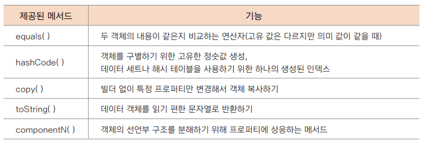

## 데이터 클래스와 기타 클래스

### 데이터 전달을 위한 데이터 클래스
- 보통 데이터 전달을 위한 객체를 DTO(Data Transfer Object) 라고 부른다
- 자바에서는 POJO(Plain Old Java Object)라고 부르기도 했다
- 코틀린의 데이터 클래스에서 내부적으로 자동 생성되는 메서드
  - 프로퍼티를 위한 게터/세터
  - 비교를 위한 equals()와 키 사용을 위한 hashCode()
  - 프로퍼티를 문자열로 변환해 순서대로 보여주는 toString()
  - 객체 복사를 위한 copy()
  - 프로퍼티에 상응하는 component1(), component2() 등
- 데이터 클래스 선언하기
  - `data class Customer(val name: String, var email: String)`
  - 조건
    - 주 생성자는 최소한 하나의 매배견수를 가져야 한다
    - 주 생성자의 모든 매개변수는 val, var로 지정된 프로퍼티여야한다
    - 데이터 클래스는 abstract, open, sealed, inner 키워드를 사용할 수 없다
  - 데이터 클래스가 자동 생성하는 매서드
    - 
  - 객체 디스트럭처링하기
    - 디스트럭처링(Destructuring)한다는 것?
      - 객체가 가지고 있는 프로퍼티를 개별 변수로 분해햐여 할당하는 것
    - cus1 객체의 프로퍼티 값 2개를 각각 name과 email로 선언된 변수에 가져온다ㅏ (언더스코러를 사용해 제외할 수도 있음)
    ```kotlin
    val (name, email) = cus1
    println("name = $name, email = $email")
    ```
    - 개별적으로 프로퍼티를 가져오기 위해 componentN() 메서드 사용 가능
    ```kotlin
    val name2 = cus1.component1()
    val email2 = cus1.component2()
    println("name = $name2, email = $email2")
    ```
    - 반복문 사용
    ```kotlin
    val cus1 = Customer("Sean", "sean@mail.com")
    val cus2 = Customer("Sean", "sean@mail.com")
    val bob = Customer("Bob", "bob@mail.com")
    val erica = Customer("Erica", "erica@mail.com")
    val customers = listOf(cus1, cus2, bob, erica) // 모든 객체를 컬렉션 List 목록으로 구성
    ...
    for((name, email) in customers) { // 반복문을 사용해 모든 객체의 프로퍼티 분해
      println("name = $name, email = $email")
    }
    ```

### 내부 클래스 기법
- 코틀린
  - 중첩 클래스
  - 내부 클래스

- 중첩 클래스
  - 기본적으로 정적(static) 클래스처럼 다루어짐
  - 즉, 중첩 클래스는 객체 생성 없이 접근 가능
  ```kotlin
  class Outer {
    
      val ov = 5
    
      class Nested {
          val nv = 10
          fun greeting() = "[Nested] Hello ! $nv" // 외부의 ov에는 접근 불가
      }
    
      fun outside() {
          val msg = Nested().greeting() // 객체 생성 없이 중첩 클래스의 메서드 접근
          println("[Outer]: $msg, ${Nested().nv}") // 중첩 클래스의 프로퍼티 접근
      }
  }
  
  fun main() {
      // static처럼 객체 생성 없이 사용
      val output = Outer.Nested().greeting()
      println(output)
  
      // Outer.outside() // 오류! 외부 클래스의 경우는 객체를 생성해야 함
      val outer = Outer()
      outer.outside()
  }
  ```
- 이너 클래스
  - 클래스 안에 이너 클래스를 정의할 수 있음
  - 이너 클래스는 바깥 클래스의 멤버들에 접근할 수 있다
  ```kotlin
  class Smartphone(val model: String) {
    private val cpu = "Exynos"
    inner class ExternalStorage(val size: Int) {
        fun getInfo() = "${model}: Installed on $cpu with ${size}Gb" // 바깥 클래스의 프로퍼티 접근
    }
  }
  
  fun main() {
    val mySdcard = Smartphone("S7").ExternalStorage(32)
    println(mySdcard.getInfo())
  }
  ```

- 지역 클래스
  ```kotlin
  fun powerOn(): String {

      class Led(val color: String) { // 지역 클래스 선언
          fun blink(): String = "Blinking $color on $model" // 외부의 프로퍼티는 접근 가능
      }

      val powerStatus = Led("Red") // 여기에서 지역 클래스가 사용됨

      return powerStatus.blink()
  } // powerOn() 블록 끝
  ```
  
- 익명 객체
  ```kotlin
  val powerSwitch = object : Switcher { // ② 익명 객체를 사용해 Switcher의 on()을 구현
          override fun on(): String {
              return powerStatus.blink()
          }
      } // 익명(object) 객체 블록의 끝
        
      return powerSwitch.on() // 익명 객체의 메서드 사용
  ```
  

### 실드 클래스와 열거형 클래스
- 실드 클래스
  - 실드(Sealed)란 '봉인된'이라는 의미로 무언가 언전하게 보관하기 위해 묶어 두는 것을 말한다
  - 실드 클래스는 미리 만들어 놓은 자료형들을 묶어서 제공하기 때문에 어떤 의미에서는 열거형(Enum) 클래스의 확장으로도 볼 수 있다
  - 실드 클래스 그 자체는 추상 클래스와 같이 때문에 객체를 만들 수 없다
  - 생성자도 기본적으로는 private이며 private이 아닌 생성자는 허용하지 않는다
  - 실드 클래스는 같은 파일 안에서는 상속이 가능하지만 다른 팦일에서는 상속이 불가능하게 제한
  - 블록 안에 선언되는 클래스는 상속이 필요한 경우 open 키워드로 선언될 수 있다
  - 선언
    - sealed 키워드를 class와 함께 사용
  - 실드 클래스 작성하기
  ```kotlin
  // 실드 클래스를 선언하는 첫 번째 방법
  sealed class Result {
    open class Success(val message: String): Result()
    class Error(val code: Int, val message: String): Result()
  }
  
  class Status: Result() // 실드 클래스 상속은 같은 파일에서만 가능
  class Inside: Result.Success("Status") // 내부 클래스 상속
  
  fun main() {
    // Success에 대한 객체 생성
    val result = Result.Success("Good!")
    val msg = eval(result)
    println(msg)
  }
  
  // 상태를 검사하기 위한 함수
  fun eval(result: Result): String = when(result) {
    is Status -> "in progress"
    is Result.Success -> result.message
    is Result.Error -> result.message
    // 모든 조건을 가지므로 else가 필요 없음
  }
  ```
- 열거형 클래스
```kotlin
enum class 클래스 이름 [(생성자)] }
  상수1[(값)], 상수2[(값)], 상수3[(값)], ...
  [; 프로퍼티 혹은 메서드]
}
```
인터페이스를 통한 열거형 클래스 구현하기
```kotlin
interface Score {
    fun getScore(): Int
}

enum class MemberType(var prio: String) : Score { // Score를 구현할 열거형 클래스
    
    NORMAL("Thrid") {
        override fun getScore(): Int = 100 // 구현된 메서드
    },
    SILVER("Second") {
        override fun getScore(): Int = 500
    },
    GOLD("First") {
        override fun getScore(): Int = 1500
    }
}

fun main() {
    println(MemberType.NORMAL.getScore())
    println(MemberType.GOLD)
    println(MemberType.valueOf("SILVER"))
    println(MemberType.SILVER.prio)
    
    for (grade in MemberType.values()) { // 모든 값을 가져오는 반복문
        println("grade.name = ${grade.name}, prio = ${grade.prio}")
    }
}
```

### 애노테이션 클래스
- 애노테이션 선언하기
  - `annotation class 어노테이션 이름`
- 속성
  - @Target: 애노테이션이 지정되어 사용할 종류(클래스, 함수, 프로퍼티 등)를 정의
  - @Retention: 애노테이션을 컴파일된 클래스 파일에 저장할 것인지 실행 시간에 반영할 것인지 결정
  - @Repeatable: 애노테이션을 같은 요소에 여러 번 사용 가능하게 할지를 결정
  - @MustBeDocumented: 애노테이션이 API의 일부분으로 문서화하기 위해 사용 
- 리플렉션 테스트 하기
  ```kotlin
  class User(val id: Int, val name: String, var grade: String ="Normal") {
      fun check() {
          if (grade == "Normal") println("You need to get the Silver grade")
      }
  }
  
  fun main() {
  // 타입을 출력
  println(User::class) // 클래스 레퍼런스를 위해 ::class 사용
  
      // 클래스의 프로퍼티와 메서드의 정보를 출력
      val classInfo = User::class
  
      // 보니까 1.7까지밖에 없음 속성이
      /*classInfo.memberProperties.forEach {
          println("Property name: ${it.name}, type: ${it.returnType}")
      }
      classInfo.memberFunctions.forEach {
          println("Function name: ${it.name}, type: ${it.returnType}")
      }*/
  
      // 함수에 전달해 자료형을 알아냄
      getKotlinType(User::class)
  }
  
  fun getKotlinType(obj: KClass<*>) {
      println(obj.qualifiedName)
  }
  ```
  - 애노테이션의 매개변수와 생성자
    - `annotation class Special(val why: String) // 애노테이션 클래스의 정의
      @Special("example") class Foo {} // 애노테이션에 매개변수를 지정`
    - 매개변수로 사용될 수 있는 자료형
      - 자바의 기본형과 연동하는 자료형
      - 열거형
      - 문자열
      - 기타 애노테이션
      - 클래스
      - 위의 목록을 가지는 배열