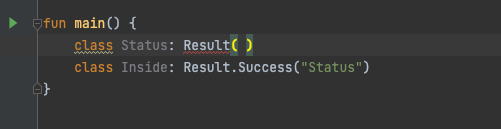

- 데이터 저장을 위해 사용하는 클래스
    - 구현부가 필요 없을 수도 있는 클래스

### 데이터 전달을 위한 데이터 클래스

- Dto를 위해 데이터 클래스를 정의할 때 자동 생성되는 메서드가 있다.
    1. 프로퍼티를 위한 게터/세터
    2. 비교를 위한 equals( )와 키 사용을 위한 hashCode( )
    3. 프로퍼티를 문자열로 변환해 순서대로 보여주는 toString( )
    4. 객체 복사를 위한 copy( )
    5. 프로퍼티에 상응하는 component1( ), component2( ) 등

**데이터 클래스 선언**

```kotlin
data class Customer(var name: String, var email: String)
```

1. 주 생성자는 최소한 하나의 매개변수 가짐
2. 주 생성자의 모든 매개변수는 val, var을 가짐
3. 데이터 클래스는 abstract, open, sealed, inner 사용 불가능
4. init은 가능

| 메서드 | 기능 |
| --- | --- |
| equals( ) | 두 객체의 내용이 같은지 비교하는 연산자(고유 값은 다르지만 의미 값이 같을 때) |
| hashCode( ) | 객체를 구별하기 위한 고유한 정숫값 생성
데이터 세트나 해시 테이블을 사용하기 위한 하나의 생성된 인덱스 |
| copy( ) | 빌더 없이 특정 프로퍼티만 변경해서 객체 복사하기
|
| toString( ) | 데이터 객체를 읽기 편한 문자열로 반환하기
|
| componentN( ) | 객체의 선언부 구조를 분해하기 위해 프로퍼티에 상응하는 메서드 |

**객체 디스트럭처링 하기 (구조분해)**

- 객체가 가지고 있는 프로퍼티를 개별 변수로 분해하여 할당

```kotlin
val (name, email) = cus1
```

- 개별적으로 프로퍼티를 가져오기 위해서 componentN() 메서드를 사용 가능

### 내부 클래스 기법

- 중첩 클래스
- 이너 클래스

**내부 클래스를 사용하는 이유**

- 다른 클래스에서 사용하지 않는 경우

자바와 코틀린 내부 클래스 비교

| 자바 | 코틀린 |
| --- | --- |
| 정적 클래스(static class) | 중첩 클래스(Nested Class): 객체 생성 없이 사용 가능 |
| 멤버 클래스(Member Class) | 이너 클래스(Inner Class): 필드나 메서드와 연동하는 내부 클래스로 inner 키워드가 필요하다. |
| 지역 클래스(Local Class)
| 지역 클래스(Local Class): 클래스의 선언이 블록 안에 있는 지역 클 래스이다. |
| 익명 클래스(Anonymous Class) | 익명 객체(Anonymous Object): 이름이 없고 주로 일회용 객체를 사용하기 위해 object 키워드를 통해 선언된다. |

**용어 정리**

```kotlin
// 이너 클래스

// java
class A {
    class B {
        
    }
}

// kotlin
class A {
    inner class B { // 자바와 달리 inner 키워드 필요
       
    }
}
```

- 외부에서 클래스에 접근 가능

```kotlin
// 중첩 클래스

// java
public class AAA {
    static class B {
        private String name;

        public B(String name) {
            this.name = name;
        }

        public String getName() {
            return name;
        }

        public void hello() {
            System.out.println("hello");
        }
        
    }
}
// kotlin
class AA {
    class B(name: String) { // 코틀린에서는 아무 키워드가 없는 클래스는 중첩 클래스이며 정적 클래스처럼 사용
        // 외부 클래스 A의 프로퍼티, 메서드에 접근할 수 없음
        private lateinit var name: String
				private val name2 = "name2"
				fun hello() = println("hello")
    }
}

fun main() {
    AA.B("l").hello()
}
```

- static 처럼 접근
- 자바에서도 getter는 접근 불가능하지만 메서드에는 접근 가능
- 외부 클래스의 프로퍼티와 메서드에는 접근 불가능 - static이여서 그런듯?

### 이너 클래스

- 이너 클래스에서는 외부 클래스의 멤버들에 접근 가능

```kotlin
class Outer {
    val ov = 5

    inner class Nested {
        val nv = 10
        fun greeting() = "[Nested] Hello ! $nv" // 외부의 ov에는 접근 불가
        fun greetingOv() = "[Nested] Hello ! $ov" // 외부의 ov에는 접근 불가
        fun outsideNested() = outside()
    }

    fun outside() {
        val msg =
            Nested().greeting() // 객체 생성 없이 중첩 클래스의 메서드 접근
        println("[Outer]: $msg, ${Nested().nv}") // 중첩 클래스의 프로퍼티 접근
    }
}
```

### 지역 클래스

- init 블록과 블록 범위에서만 유효한 클래스

```kotlin
class Smartphone(val model: String) {
    private val cpu = "Exynos"
    fun powerOn(): String {
        class Led(val color: String) { // 지역 클래스 선언
            fun blink(): String = "Blinking $color on $model" // 외부의 프로퍼티는 접근 가능
        }

        val powerStatus = Led("Red") // 여기에서 지역 클래스가 사용됨 
        return powerStatus.blink( )
    } // powerOn( ) 블록 끝 
}
```

### 익명 객체

- 자바에서는 익명 이너 클래스라는 것을 제공해 일회성으로 객체를 생성해 사용
- 코틀린에서는 object 키워드를 사용하는 익명 객체로 이와 같은 기능을 수행

```kotlin
class Smartphone2(val model: String) {
    private val cpu = "Exynos"
    fun powerOn(): String {
        class Led(val color: String) { // 지역 클래스 선언
            fun blink(): String = "Blinking $color on $model" // 외부의 프로퍼티는 접근 가능
        }

        val powerStatus = Led("Red") // 여기에서 지역 클래스가 사용됨
        val powerSwitch = object : Switcher { // 2 익명 객체를 사용해 Switcher의 on( )을 구현
            override fun on(): String {
                return powerStatus.blink()
            }
        } // 익명(object) 객체 블록의 끝
        return powerSwitch.on();
    } // powerOn( ) 블록 끝
}
```

### 실드 클래스

- sealed 키워드를 class와 함께 사용
- 실드 클래스는 추상 클래스와 같기 때문에 객체를 만들 수 없음
- 생성자도 기본적으로 private, private 외에는 허용하지 않음

```kotlin
sealed class Result {
    open class Success(val message: String) : Result()
    class Error(val code: Int, val message: String) : Result()
}

class Status : Result() // 실드 클래스 상속은 같은 파일에서만 가능 
class Inside: Result.Success("Status") // 내부 클래스 상속
```

```kotlin
sealed class Result
open class Success(val message: String) : Result()
class Error(val code: Int, val message: String) : Result()
class Status : Result()
class Inside : Success("Status")
```



외부에서 접근하려고 할 경우 sealed class는 접근 불가능

**그렇다면 이렇게 사용하는 이유는?**

```kotlin
fun main( ) {
    val result = Result.Success("Good!")
    val msg = eval(result)
    println(msg)
}

fun eval(result: Result): String = when(result) {
    is Status -> "in progress"
    is Result.Success -> result.message
    is Result.Error -> result.message
}
```

- 결국 Result를 상속받기 때문에 특정 객체 자료형에 따라 선택적 실행 가능
- 유용하게 쓰일듯??

### 열거형(이넘) 클래스

```kotlin
enum class DayOfWeek(val num: Int) {
    MONDAY(1), TUESDAY(2), WEDNESDAY(3), THURSDAY(4), FRIDAY(5), SATURDAY(6), SUNDAY(7)
}
```

```kotlin
interface Score {
    fun getScore(): Int
}

enum class MemberType(var prio: String) : Score {
    NORMAL("Thrid") {
        override fun getScore(): Int = 100 // 구현된 메서드 
    },
    SILVER("Second") {
        override fun getScore(): Int = 500
    },
    GOLD("First") {
        override fun getScore(): Int = 1500
    }
}
```

- 인터페이스 구현도 가능

```kotlin
// java 에서는
public enum Ord implements OrdInterface{

    ORD1, ORD2;

    @Override
    public void ord() {

    }
}
```

- 자바에서는 이런식밖에 안되는듯?

### 어노테이션 클래스

- 애노테이션(Annotation)은 코드에 부가 정보를 추가하는 역할

```kotlin
annotation class 애노테이션 이름
```

- @Target: 애노테이션이 지정되어 사용할 종류(클래스, 함수, 프로퍼티 등)를 정의
- @Retention: 애노테이션을 컴파일된 클래스 파일에 저장할 것인지 실행 시간에 반영할 것인지 결정
- @Repeatable: 애노테이션을 같은 요소에 여러 번 사용 가능하게 할지를 결정
- @MustBeDocumented: 애노테이션이 API의 일부분으로 문서화하기 위해 사용