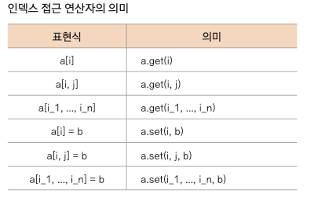
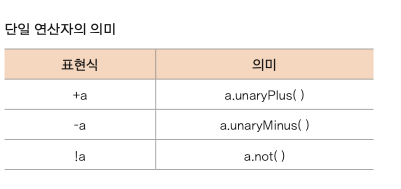
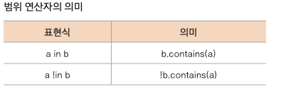
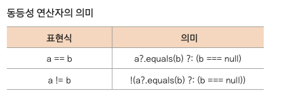
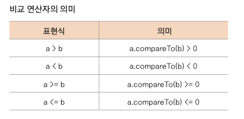

### 연산자 작동 방식

- a + b는 a.plus(b)라는 함수가 내부적으로 호출됨

```kotlin
fun main() {
    val a = 5
    val b = 10
    a.plus(b)
}
```

plus에 들어가보면 다양한 자료형들의 plus가 오버로딩으로 선언되어 있습니다.

```kotlin
class Point(var x: Int = 0, var y: Int = 10) {
    // plus( ) 함수의 연산자 오버로딩
    operator fun plus(p: Point): Point {
        return Point(x + p.x, y + p.y)
    }
    operator fun dec( ) = Point(--x, --y)
}

fun main() {
    var point = Point()
    --point
}
```

- 클래스 안에서 오버로딩 가능

### 연산자 종류

**호출 연산자**

- 함수 호출을 돕는데 사용

```kotlin
class Manager {
    operator fun invoke(value: String) {
        println(value)
    }
}

fun main() {
    val manager = Manager() 
    manager ("Do something for me!") // invoke 생략
}
```

**인덱스 접근 연산자*


**단일 연산자**



**범위 연산자**



**대입 연산자**


**동등성 연산자**



**비교 연산자**

