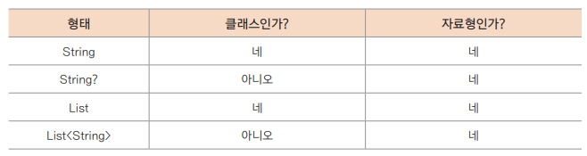
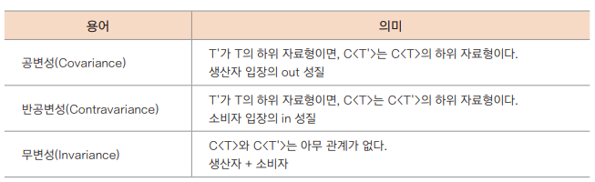
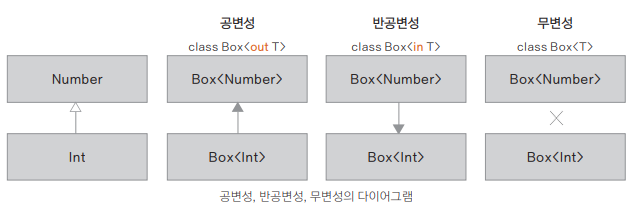
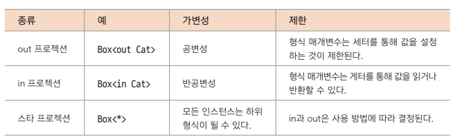

## 제네릭 다루기

- 제네릭(Generic)
  - 클래스 내부에서 사용할 자료형을 나중에 인스턴스를 생성할 때 확정
  - 배경: 자료형의 객체들을 다루는 메서드나 클래스에서 컴파일 시간에 자료형을 검사해 적당한 자료형을 선택할 수 있도록 하기 위함

### 제네릭의 일반적인 사용 방법
```kotlin
class Box<T>(t: T) { // 형식 매개변수로 받은 인자를 name에 저장
    var name = t
}

fun main() {
    val box1: Box<Int> = Box<Int>(1)
    val box2: Box<String> = Box<String>("Hello")

    println(box1.name)
    println(box2.name)
}
```
**Generic 에서 사용하는 형식 매개변수 이름**
- E : 요소 (Element)
- K : 키 (Key)
- N : 숫자 (Number)
- T : 형식 (Type)
- V : 값 (Value)
- S, U, V etc. : 두 번째, 세 번째, 네 번째 형식

**제네릭 클래스**
- 제네릭 클래스는 형식 매개변수를 1개 이상 받는 클래스
- 클래스를 선언할 때 자료형을 특정하지 않고 인스턴스를 생성하는 시점에서 클래스의 자료형을 정하는 것

```kotlin
class MyClass<T> { // 1개의 형식 매개변수를 가지는 클래스
 fun myMethod(a: T) { // 메서드의 매개변수 자료형에 사용됨
 ...
 }
}
```

**자료형 변환**
```kotlin
open class Parent

class Child: Parent()

class Cup<T>

fun main() {
    val obj1: Parent = Child() // Parent 형식의 obj1은 Child의 자료형으로 변환될 수 있음
    // val obj2: Child = Parent() // 오류! 자료형 불일치
    // val obj3: Cup<Parent> = Cup<Child>() // 오류! 자료형 불일치
    // val obj4: Cup<Child> = Cup<Parent>() // 오류! 자료형 불일치
    val obj5 = Cup<Child>() // obj5는 Cup<Child>의 자료형이 됨
    val obj6: Cup<Child> = obj5 // 자료형이 일치하므로 OK!
}
```

**형식 매개변수의 null 제어**
```kotlin
class GenericNull<T> { // 기본적으로 null이 허용되는 형식 매개 변수
    // null을 허용하지 않게 하려면 <T: Any> 로 선언하면 된다

    fun equalityFunc(arg1: T, arg2: T) {
        println(arg1?.equals(arg2))
    }
}

fun main() {
    
    val obj = GenericNull<String>() // non-null로 선언됨
    obj.equalityFunc("Hello", "World") // null이 허용되지 않음

    val obj2 = GenericNull<Int?>() // null이 가능한 형식으로 선언됨
    obj2.equalityFunc(null, 10)
}
```

**제네릭 함수 혹은 메서드**
- `fun <형식 매개변수[,...]> 함수 이름(매개변수: <매개변수 자료형>[, ...]): <반환 자료형>`
- 형식 매개변수를 받는 함수나 메서드를 제네릭 함수 또는 메서드라고 한다
```kotlin
fun <T> find(a: Array<T>, Target: T): Int {
    for (i in a.indices) {
        if (a[i] == Target) return i
    }
    return -1
}

fun main() {
    val arr1: Array<String> = arrayOf("Apple", "Banana", "Cherry", "Durian")
    val arr2: Array<Int> = arrayOf(1, 2, 3, 4)

    println("arr.indices ${arr1.indices}") // indices는 배열의 유효 범위 반환
    println(find<String>(arr1, "Cherry")) // 요소 C의 인덱스 찾아내기
    println(find(arr2, 2)) // 요소 2의 인덱스 찾아내기
}
```

**제네릭과 람다식**
```kotlin
fun <T> add(a: T, b: T, op: (T, T) -> T): T {
    return op(a, b)
}

fun main() {
    val result = add(2, 3) { a, b -> a + b }
    println(result)

    println(add(2, 3, sumInt))
    println(add(2, 3, sumInt2))
}

var sumInt: (Int, Int) -> Int = { a, b -> a + b } // 변수 선언부가 있는 경우 표현식의 자료형 생략
var sumInt2 = { a: Int, b: Int -> a + b } // 변수 선언부가 생략된 경우에는 표현식에 자료형 표기
```
- typealias
  - 기존 유형에 대한 대체 이름을 제공
    - 제네릭 유형 줄이기
      ```kotlin
      typealias FileTable<K> = MutableMap<K, MutableList<File>>typealias NodeSet = Set<Network.Node>
      typealias FileTable<K> = MutableMap<K, MutableList<File>>
      ```
    - 함수 유형 
      ```kotlin
      typealias MyHandler = (Int, String, Any) -> Unit
      typealias Predicate<T> = (T) -> Boolean
      ```
    - 내부 및 중첩 클래스
      ```kotlin
      class A {
        inner class Inner
      }
      class B {
        inner class Inner
      }

      typealias AInner = A.Inner
      typealias BInner = B.Inner
      ```
  - 공식 문서 : https://kotlinlang.org/docs/type-aliases.html

### 자료형 제한하기

**클래스에서 형식 매개변수의 자료형 제한하기**
- 자료형을 숫자형으로 제한하기
```kotlin
class Calc<T: Number> { // 클래스의 형식 매개변수 제한
    fun plus(arg1: T, arg2: T): Double {
        return arg1.toDouble() + arg2.toDouble()
    }
}

fun main() {
    val calc = Calc<Int>()
    println(calc.plus(10,20))

    val calc2 = Calc<Double>()
    val calc3 = Calc<Long>()
    // val calc4 = Calc<String>() // 제한된 자료형으로 인해 오류 발생!

    println(calc2.plus(2.5,3.5))
    println(calc3.plus(5L, 10L))
}
```
- 함수에서 형식 매개변수의 자료형 제한하기
```kotlin
fun <T: Number> addLimit(a: T, b: T, op: (T, T) -> T): T {
   return op(a, b)
}
...
val result = addLimit("abc", "def", {a, b -> a + b}) // 제한된 자료형으로 인해 오류 발생!
```
- 다수 조건의 형식 매개변수 제한하기
```kotlin
interface InterfaceA
interface InterfaceB

class HandlerA: InterfaceA, InterfaceB
class HandlerB: InterfaceA

class ClassA<T> where T:InterfaceA, T:InterfaceB // 2개의 인터페이스를 구현하는 클래스로 제한

fun main() {
   val obj1 = ClassA<HandlerA>() // 객체 생성 가능
   val obj2 = ClassA<HandlerB>() // 범위에 없으므로 오류 발생!
}
```

### 상, 하위 형식의 가변성
**클래스와 자료형**



(Int는 Int? 의 하위 자료형이다)

**가변성의 3가지 유형**



**무변성**
- 형식 매개변수에 in이나 out 등으로 공변성이나 반공변성을 따로 지정하지 않으면 무변성(Invariance)으로 제네릭 클래스가 선언
- 상하 관계를 잘 따졌어도 `Box<T>`가 무변성이므로 자료형 불일치 오류를 발생
- (선언이 같아야 함)
```kotlin
// 무변성(Invariance) 선언
class Box<T>(val size: Int)

fun main() {
   val anys: Box<Any> = Box<Int>(10) // 오류! 자료형 불일치
   val nothings: Box<Nothing> = Box<Int>(20) // 오류! 자료형 불일치
}
```

**공변성**
- 형식 매개변수의 상하 자료형 관계가 성립하고, 그 관계가 그대로 인스턴스 자료형 관계로 이어지는 경우를 공변성(Covariance)이라고 한다
- Any의 하위 클래스인 Int는 공변성을 가지므로 `Box<Any>`에 `Box<Int>` 자료형을 할당할 수 있게 되었다
- (상속 개념 사용 가능)
```kotlin
// 공변성(Covariance) 선언
class Box<out T>(val size: Int)

fun main() {
   val anys: Box<Any> = Box<Int>(10) // 관계 성립으로 객체 생성 가능
   val nothings: Box<Nothing> = Box<Int>(20) // 오류! 자료형 불일치
}
```

**반공병성**
- 자료형의 상하 관계가 반대가 되어 인스턴스의 자료형이 상위 자료형이 된다
- (상속 개념의 반대)
```kotlin
// 반공변성(Contravariance) 선언
class Box<in T>(val size: Int)

fun main() {
   val anys: Box<Any> = Box<Int>(10) // 오류! 자료형 불일치
   val nothings: Box<Nothing> = Box<Int>(20) // 관계 성립으로 객체 생성 가능
}
```

**공변성에 따른 자료형 제한하기**
```kotlin
open class Animal(val size: Int) {
    fun feed() = println("Feeding...")
}

class Cat(val jump: Int): Animal(50)
class Spider(val poison: Boolean): Animal(1)

// ① 형식 매개변수를 Animal로 제한
class Box<out T: Animal>(val element: T) { // 주 생성자에서는 val만 허용
    
    fun getAnimal(): T = element // ② out은 반환 자료형에만 사용할 수 있음
    
    // fun set(new: T) { // ③ 오류! T는 in 위치에 사용할 수 없음
    //     element = new
    // }
}

fun main() {
    // 일반적인 객체 선언
    val c1: Cat = Cat(10)
    val s1: Spider = Spider(true)
    var a1: Animal = c1 // 클래스의 상위 자료형으로 변환하는 것은 아무런 문제 없음

    a1 = s1 // ④ a1은 Spider의 객체가 됨
    println("a1.size = ${a1.size}")

    val c2: Box<Animal> = Box<Cat>(Cat(10)) // ⑤ 공변성 - Cat은 Animal의 하위 자료형
    println("c2.element.size = ${c2.element.size}")

    // val c3: Box<Cat> = Box<Animal>(10) // ⑥ 오류! 반대의 경우는 인스턴스화되지 않음
    // val c4: Box<Any> = Box<Int>(10) // ⑦ 오류! 자료형을 제한하여 Animal과 하위 클래스 이외에는 사용할 수 없음
}
```

### 자료형 프로젝션
**가변성의 2가지 방법**
- 선언 지점 변성(declaration-site variance)
  - 클래스를 선언하면서 클래스 자체에 가변성을 지정하는 방식
  -  가변성을 지정하면 클래스의 공변성을 전체적으로 지정
- 사용 지점 변성(use-site variance)
  - 메서드 매개변수에서 또는 제네릭 클래스를 생성할 때와 같이 사용 위치에서 가변성을 지정하는 방식
  - 형식 매개변수가 있는 자료형을 사용할 때마다 해당 형식 매개변수를 하위 자료형이나 상위 자료형 중 어떤 자료형으로 대체 할 수 있는지를 명시

**사용 지점 변성과 자료형 프로젝션**
- 사용하고자 하는 요소의 특정 자료형에 in 혹은 out을 지정해 제한하는 것을 자료형 프로젝션(Type Projection)이라고 한다
- 이렇게 사용할 수 있는 위치를 제한하는 이유는 자료형 안정성을 보장하기 위해서이다

`class Box<T>(var item: T)`

Box class는 in, out을 지정하지 않아 무변성이다 Box의 item을 얻기 위해서는 out이 지정되어야 한다

<br>

**스타 프로젝션**
- `Box<>`에 자료형이 `Box<Any?>`가 되면 모든자료형의 요소를 담을 수 있음을 의미
- `Box<*>`는 어떤 자료형이라도 들어올 수 있으니 구체적으로 자료형이 결정되고 난 후에는 그 자료형과 하위 자료형의 요소만 담을 수 있도록 제한
- 스타(*)를 통해 지정하는 방법을 스타 프로젝션이라고 한다

**자료형 프로젝션의 정리**



### reified 자료형
`fun <T> myGenericFun(c: Class<T>)`
- 여기서 T 자료형은 자바처럼 실행 시간에 삭제되기 때문에 T 자체에 그대로 접근할 수 없다 (컴파일 시간에는 접근 가능)
- 함수 내부에서 사용하려면 위의 코드에서 함수의 매개면수를 넣어 `c: Class<T>`처럼 지정해야만 실행 시간에 사라지지 않고 접근할 수 있다
- reified로 형식 매개변수 T를 지정하면 실행 시간에 접근할 수 있다

```kotlin
fun main() {
    val result = getType<Float>(10)
    println("result = $result")
}

inline fun <reified T> getType(value: Int): T {
    println(T::class) // 실행 시간에 삭제되지 않고 사용 가능
    println(T::class.java)

    return when (T::class) { // 받아들인 제네릭 자료형에 따라 반환
        Float::class -> value.toFloat() as T
        Int::class -> value as T
        else -> throw IllegalStateException("${ T::class } is not supported!")
    }
}
```


