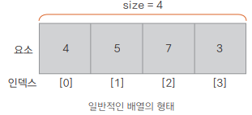
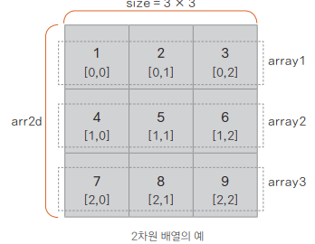

## 배열 다루기

코틀린에서 배열은 Array 클래스로 표현

### 배열을 사용하는 방법
**기본적인 배열 표현**
- arrayOf()나 Array()
- 
**다차원 배열**
- `val arr2d = arrayOf(arrayOf(1, 2, 3), arrayOf(4, 5, 6), arrayOf(7, 8, 9))`
- 
**배열에 여러 가지 자료형 혼합하기**
- `val mixArr = arrayOf(4, 5, 7, 3, "Chike", false) // 정수, 문자열, Boolean 혼합`
- 제한하기 : `arrayOf<자료형 이름>()` 형태나 자료형 이름 + `ArrayOf()`

**배열 요소에 접근하기**
```kotlin
fun main() {
    val arr = intArrayOf(1, 2, 3, 4, 5)
    println("arr: ${arr.contentToString()}") // Arrays.toString()은 배열의 내용을 문자열로 변환
    println("size: ${arr.size}") // size는 배열의 크기를 나타냄
    println("sum(): ${arr.sum()}") // sum() 메서드는 배열의 합을 계산
    
    // 게터에 의한 접근과 대괄호 연산자 표기법
    println(arr.get(2))
    println(arr[2])
    
    // 세터에 의한 값의 설정
    arr.set(2, 7)
    arr[0] = 8
    println("size: ${arr.size} arr[0]: ${arr[0]}, arr[2]: ${arr[2]}")
    
    // 루프를 통한 배열 요소의 접근
    for (i in arr.indices) {
        println("arr[$i] = ${arr[i]}")
    }
}
```

**배열의 내용 한꺼번에 출력하기**
- `Arrays.toString(arr)` *idle에서 `arr.contentToString()`으로 바꿔줌*
- `Arrays.deepToString(arr)` *idle에서 `arr.contentDeepToString()`으로 바꿔줌*

**표현식을 통해 배열 생성하기**
- `val|var 변수 이름 = Array(요소 개수, 초깃값)`
- `val arr3 = Array(5, {i -> i * 2})` --> [0, 2, 4, 6, 8]
- `var a = arrayOfNulls <Int>(1000) // 1000개의 null로 채워진 정수 배열`
- `var a = Array(1000, { 0 }) // 0으로 채워진 정수 배열`
- `var a = Array(1000, { i -> myClass(i) })`

### 배열 제한하고 처리하기
- 배열에 요소 추가하고 잘라내기
  - `val arr2 = arr.plus(1) // 하나의 요소를 추가한 새 배열 생성`
  - `val arr3 = arr.sliceArray(0..2) // 필요한 범위를 잘라내 새 배열 생성`
  - 배열이 일단 정의되면 고정되기 때문에 다음과 같이 새로 할당하는 방법으로 요소를 추가하거나 잘라낼 수 있다
- 기타 배열 관련 API 사용하기
  - `arr.first()` -> 첫 번째 요소 확인
  - `arr.last()` -> 마지막 요소 확인
  - `arr.indexOf(3)` -> 요소 3의 인덱스 출력
  - `arr.average()` -> 배열의 평균 값 출력
  - `arr.count()` -> 요소 개수 세기
  - `arr.contains(4)` -> arr 배열에 요소 4가 포함 되었는지 확인
  - `4 in arr` -> 위와 같은 표현
- 다양한 자료형을 위한 Any로 선언된 배열
  ```kotlin
    fun main() {
      val b = Array<Any>(10) { 0 }
      b[0] = "Hello World"
      b[1] = 1.1
    
      println(b[0])
      println(b[1])
      println(b[2])
    }
  ```
- 멤버 메서드를 통한 배열 순환하기
  - `arr.forEash { element -> }`
  - `arr.forEachIndexed({ i, e -> })`
  - `arr.iterator() // while 로 순환` 

### 배열 정렬하기
- 기본 배열 정렬하고 반환하기
```kotlin
fun main() {
    val arr = arrayOf(8, 4, 3, 2, 5, 9, 1)

    // ① 오름차순, 내림차순으로 정렬된 일반 배열로 반환
    val sortedNums = arr.sortedArray()
    println("ASC: ${ sortedNums.contentToString() }")

    val sortedNumsDesc = arr.sortedArrayDescending()
    println("DEC: ${ sortedNumsDesc.contentToString() }")

    // ② 원본 배열에 대한 정렬
    arr.sort(1, 3) // sort(fromIndex, toIndex)
    println("ORI: ${ arr.contentToString() }")

    arr.sortDescending()
    println("ORI: ${ arr.contentToString() }")

    // ③ List로 반환
    val listSorted: List<Int> = arr.sorted()
    val listDesc: List<Int> = arr.sortedDescending()

    println("LST: $listSorted")
    println("LST: $listDesc")

    // ④ SortBy를 이용한 특정 표현식에 따른 정렬
    val items = arrayOf("Dog", "Cat", "Lion", "Kangaroo", "Po")
    items.sortBy { item -> item.length }
    println(items.contentToString())
}
```
- sortBy()로 데이터 클래스 정렬하기
```kotlin
data class Product(val name: String, val price: Double)

fun main() {
    val products = arrayOf(
        Product("Snow Ball", 870.00),
        Product("Smart Phone", 999.00),
        Product("Drone", 240.00),
        Product("Mouse", 333.55),
        Product("Keyboard", 125.99),
        Product("Monitor", 1500.99),
        Product("Tablet", 512.99))

    products.sortByDescending { it.price } // 값에 따라 정렬
    products.forEach { println(it) }
}
```
- sortWith() 비교자로 정렬하기
```kotlin
products.sortWith { p1, p2 -> // Comparator를 이용해 두 객체를 비교하여 p1이 크면 1, 같으면 0, 작으면 -1
        when {
            p1.price > p2.price -> 1
            p1.price == p2.price -> 0
            else -> -1
        }
    }
products.forEach { println(it) }

// compareBy를 함께 사용해 2개의 정보 정렬
products.sortWith(compareBy({it.name}, {it.price}))
products.forEach { println(it) }
```
- 배열 필터링 하기 (필요한 정보만 골라내어 변경하기)
```kotlin
fun main() {
    val fruits = arrayOf("banana", "avocado", "apple", "kiwi")
    fruits
        .filter { it.startsWith("a") }
        .sortedBy { it }
        .map { it.uppercase(Locale.getDefault()) }
        .forEach { println(it) }
}
```
```kotlin
// 지정된 필드의 가장 작은 값과 큰 값 골라내기
println(products.minBy { it.price })
println(products.maxBy { it.price })
```

### 배열 평탄화하기
- 다차원 배열을 단일 배열로 만드는 것을 `배열을 평탄화(flatten)한다`라고 말한다
```kotlin
fun main() {
    val numbers = arrayOf(1, 2, 3)
    val strs = arrayOf("one", "two", "three")
    val simpleArray = arrayOf(numbers, strs) // 2차원 배열

    simpleArray.forEach { println(it.contentToString()) }

    val flattenSimpleArray = simpleArray.flatten() // 단일 배열로 변환하기
    println(flattenSimpleArray)
}
```

