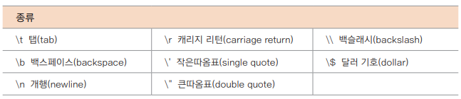
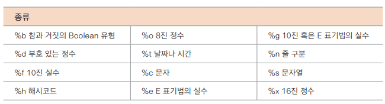

## 문자열 다루기

### 문자열의 기본 처리
- 문자열은 연속된 문자의 배열과 같다
- 문자열은 불변값으로 생성되기 때문에 참조되고 있는 메모리가 변경될 수 없다
- 새로운 값을 할당하려고 하면 기존 메모리 이외의 새로운 문자여릉ㄹ 위한 메모리를 만들어 할당해야한다

<br>

- `val hello: String = "Hello World!"`
- `println(hello[0]) // H`
- `hello[0] = 'K' // 오류!`
- `var s = "abcdef"`
- `s = "xyz" // 새로운 메모리 공간이 생성`

> **메모리 관점의 String
> 
> - JVM 을 기반으로 동작하는 코틀린은 자바에서 만들어진 구조의 메모리를 사용
> - 자바의 String은 2가지 방법으로 초기화되는데 리터럴(literal)과 new 연산자에 의해 만들어진다
> 
> `String s1 = "hello";`
> `String s2 = "hello";`
> `String s3 = new String("hello");`
> - s1, s2는 리터럴 기반의 참조 자료형으로 생성되어 JVM의 메모리 중 상수 풀(Constant Pool)에 저장된다
> - 따라서 s1, s2의 "hello"라는 정보는 완전히 동일한 공간에 있다
> - 하지만 new로 선언되면 String의 객체는 힙에 생성되며 이때 s3의 "hello"는 다른 공간에 저장된다
> 
> - 자바 7부터는 상수 풀의 영역이 힙 영역으로 옮겨져 기존의 메모리 부족 오류를 개선했다
> - 기존에 문자열은 GC 대상에 없었으나, 자바 7 이후는 GC 대상에 포함되어 참조가 없으면 메모리에서 삭제된다

- 문자열 추출하고 병합하기
```kotlin
String.substring(인덱스 범위 지정): String
CharSequence.subSequence(인덱스 범위 지정): CharSequence
```
- 문자열 비교하기
```kotlin
var s1 = "Hello Kotlin"
var s2 = "Hello KOTLIN"
// 같으면 0, s1<s2 이면 양수, 반대면 음수를 반환
println(s1.compareTo((s2)))
println(s1.compareTo(s2, true)) // 대소문자 무시
```
- StringBuilder 사용하기
```kotlin
var s = StringBuilder("Hello")
s[2]='x' // 허용되지 않았던 요소의 변경이 가능함. 결과는 Hexlo

s.append("World") // 문자열이 추가되어 HexloWorld
s.insert(10,"Added") // 인덱스 10번부터 추가되어 HexloWorldAdded
s.delete(5,10) // 인덱스 5번부터 10번 전까지 삭제되어 HexloAdded
```
  - StringBuilder를 사용하면 문자열이 사용할 공간을 좀 더 크게 잡있다
  - 때문에 요소를 변경할 때 이 부분이 사용되어 특정 단어를 변경할 수 있게 된다
  - 단, 기존의 문자열보다는 처리 속도가 좀 느리고, 만일 단어를 변경하지 않고 그대로 사용하면 임시 공간인 메모리를 조금 더 사용하게 되므로 낭비된다는 단점이 있다
  - 문자열이 자주 변경되는 경우에 사용하면 좋다

- 기타 문자열 처리
  - `str.toLowerCase()`
  - `str.toUpperCase()`
  - `str.split()`
  - `str.trim()`
- 문자을 정수로 변환하기
  - `str.toInt()`

### 리터럴 문자열
이스케이프 문자의 종류


형식 문자의 종류


### 서점 만들기
어제 객체지향 세미나를 듣고 내 맘대로 바꿔서 만들어봄...
깃 참고!
