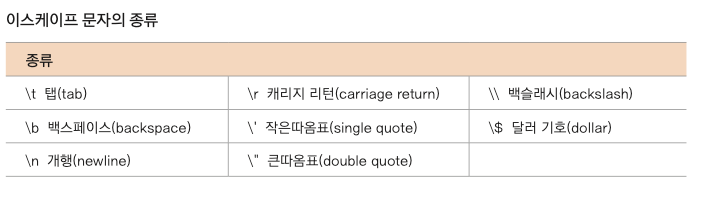

```kotlin
val hello: String = "Hello World!"
hello[0] // H 접근 가능

var  s = "aaa"
s = "bbb" // 새로운 메모리 공간 생성
```

**메모리 관점의 String**

```kotlin
String s1 = "hello";
String s2 = "hello";
String s3 = new String("hello");

JVM의 메모리 중 상수 풀(Constant Pool)에 저장
s1, s2는 동일한 공간에 있음
하지만 new로 생성하게되면 힙에 생성됨 (즉 다른 공간)
```

substring

```kotlin
fun main() {
    val s = "sss"
    s.substring(0..2)
}
```

compareTo

```kotlin
fun main() {
    var s1 = "Hello Kotlin"
    var s2 = "Hello KOTLIN"
    // 같으면 0, s1<s2 이면 양수, 반대면 음수를 반환 
    println(s1.compareTo((s2))) 
    println(s1.compareTo(s2, true)) // 대소문자 무시
}
```

StringBuilder

```kotlin
var s = StringBuilder("Hello")
s[2]='x' // 허용되지 않았던 요소의 변경이 가능함. 결과는 Hexlo

s.append("aaa")
s.insert(10, "aa")
s.delete(5, 10)
```

그 외

- split(” ”)
- toInt()
- trimMargin()

### 리터럴 문자열



- “””  …..   “”” 을 사용하면 리터럴 문자 무시

format

```kotlin
val pi = 3.1415926
val dec = 10
val s = "hello"
println("pi = %.2f, %3d, %s".format(pi, dec, s))
```