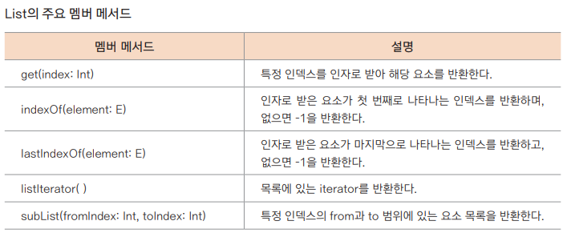
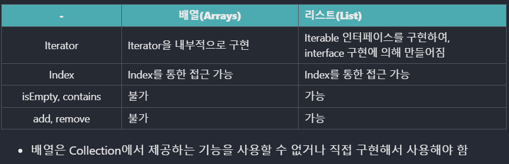

## List 활용하기

- 불변형 List -> 헬퍼 함수 listOf()
- 가변형 List -> mutableListOf()

> 헬퍼 함수 : list와 같은 컬렉션은 직접 사용해 생성하지 않고 특정 함수의 도움을 통해 생성하는데 이때 사용하는 함수를 헬퍼(Helper) 함수라고 한다

### 불변형 List 생성하기
- listOf() 함수
  - `public fun <T> listOf(vararg elements: T): List<T>`
  - ```kotlin
    fun main() {
      // 불변형 List의 사용
      val numbers: List<Int> = listOf(1, 2, 3, 4, 5)
      val names: List<String> = listOf("one", "two", "three")

      for (name in names) {
        println(name)
      }

      for (num in numbers) print(num) // 한 줄에서 처리하기
      println() // 내용이 없을 때는 한 줄 내리는 개행
    }
    ```
  - 서로 다른 자료형으로 선언하면 Any 형이 됨
- 컬렉션 반복하기
  - 위 예시에 나와있음
  - 인덱스 지정하고 싶으면
    ```kotlin
    for (index in fruits.indices) { // 인덱스 지정
      println("fruits[$index] = ${fruits[index]}")
    }
    ```
- emptyList() 함수
  - `val emptyList: List<String> = emptyList<String>()`
- listOfNotNull() 함수
  - `val nonNullsList: List<Int> = listOfNotNull(2, 25, 2, null, 5, null)`
  - 
- List의 기본 멤버 메서드 사용해보기
```kotlin
fun main() {
    val names: List<String> = listOf("one", "two", "three")
    println(names.size) // List 크기
    println(names.get(0)) // 해당 인덱스의 요소 가져오기 (idle에서 바꾸라 그럼)
    println(names.indexOf("three")) // 해당 요소의 인덱스 가져오기
    println(names.contains("two")) // 포함 여부 확인 후 포함되어 있으면 true 반환
}
```

### 가변형 List 생성하기
**가변형 arrayListOf() 함수** <br>
`public fun <T> arrayListOf(vararg elements: T): ArrayList<T>`
- 가변형 List 사용하기
```kotlin
fun main() {
    // 가변형 List를 생성하고 자바의 ArrayList로 반환
    val stringList: ArrayList<String> = arrayListOf("Hello", "Kotlin", "Wow")
    stringList.add("Java") // 추가
    stringList.remove("Hello") // 삭제
    println(stringList)
}
```
**가변형 mutableListOf() 함수** <br>
`public fun <T> mutableListOf(vararg elements: T): MutableList<T>`
- kotlin의 MutableList 사용하기
```kotlin
fun main() {
    // 가변형 List의 생성 및 추가, 삭제, 변경
    val mutableList: MutableList<String> = mutableListOf<String>("Kildong", "Dooly", "Chelsu")
    mutableList.add("Ben") // 추가
    mutableList.removeAt(1) // 인덱스 1번 삭제
    mutableList[0] = "Sean" // 인덱스 0번을 변경, set(index: Int, element: E)와 같은 역할
    println(mutableList)

    // 자료형의 혼합
    val mutableListMixed = mutableListOf("Android", "Apple", 5, 6, 'X')
    println(mutableListMixed)
}
```
- 불변형 List를 가변형으로 변환하기
```kotlin
fun main() {
    val names: List<String> = listOf("one", "two", "three") // 불변형 List 초기화
    val mutableNames = names.toMutableList() // 새로운 가변형 List가 만들어짐
    mutableNames.add("four") // 가변형 List에 하나의 요소 추가
    println(mutableNames)
}
```

<br>

**List와 배열의 차이**

https://youjourney.github.io/archivers/ARRAYLIST


