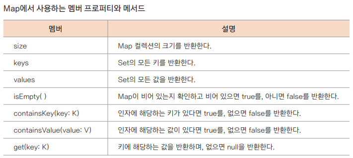
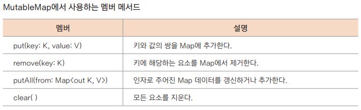

## Set 과 Map 활용하기

### Set 생성하기

**불변형 setOf() 함수** <br>
```kotlin
fun main() {
    val mixedTypesSet = setOf("Hello", 5, "world", 3.14, 'c') // 자료형 혼합 초기화
    val intSet = setOf(1, 5, 5) // 정수형만 초기화
    
    println(mixedTypesSet)
    println(intSet)
}
```

**가변형 mutableSetOf() 함수**
```kotlin
fun main() {
    // 불변형 Set 정의하기
    val animals = mutableSetOf("Lion", "Dog", "Cat", "Python", "Hippo")
    println(animals)
    
    // 요소의 추가
    animals.add("Dog") // 요소 중 "Dog"가 이미 존재하므로 변화 없음
    println(animals)
    
    // 요소의 삭제
    animals.remove("Python")
    println(animals)
}
```

### Set 의 여러 가지 자료구조
**hashSetOf() 함수**
```kotlin
fun main() {
    val intsHashSet: HashSet<Int> = hashSetOf(6, 3, 4, 7) // 불변성 기능이 없음
    intsHashSet.add(5) // 추가
    intsHashSet.remove(6) // 삭제
    println(intsHashSet)
}
```

> 빅 오 표기법
> 빅 오(Big-O) 표기법은 알고리즘 성능을 평가하는 방법입니다. 최악의 성능에 대한 측정을 통해 ‘최소한 이 정도의 성능은 보장한다’라는 의미를 가지고 있습니다. 예를 들어 O(1)은 데이터의 양과 상관없이 항상 일정한 실행 시간으로 검색할 수 있다는 것을 의미하고 O(n)은 데이터의 양이 늘어날수록 검색 시간도 늘어날 수 있음을 의미합니다.

**sortedSetOf() 함수**
```kotlin
fun main() {
    // 자바의 java.util.TreeSet 선언
    val intsSortedSet: TreeSet<Int> = sortedSetOf(4, 1, 7, 2)
    intsSortedSet.add(6)
    intsSortedSet.remove(1)
    
    println("intsSortedSet = $intsSortedSet")
    intsSortedSet.clear() // 모든 요소 삭제
    println("intsSortedSet = $intsSortedSet")
}
```
**likedSetOf() 함수**
```kotlin
fun main() {
    // Linked list를 이용한 HashSet
    val intsLinkedHashSet: java.util.LinkedHashSet<Int> = linkedSetOf(35, 21, 76, 26, 75)
    intsLinkedHashSet.add(4)
    intsLinkedHashSet.remove(21)
    
    println(intsLinkedHashSet)
    intsLinkedHashSet.clear()
    println(intsLinkedHashSet)
}
```

### Map의 활용
**불변형 mapOf()**
- `val map: Map<Key, Value> = mapOf(key to value[, ...])`
```kotlin
fun main() {
    // 불변형 Map의 선언 및 초기화
    val langMap: Map<Int, String> = mapOf(11 to "Java", 22 to "Kotlin", 33 to "C++")
    for ((key, value) in langMap) { // 키와 값의 쌍을 출력
        println("key=$key, value=$value")
    }
    
    println("langMap[22] = ${langMap[22]}") // 키 22에 대한 값 출력
    println("langMap.get(22) = ${langMap.get(22)}") // 위와 동일한 표현
    println("langMap.keys = ${langMap.keys}") // 맵의 모든 키 출력
}
```


**가변형 mutableMapOf() 함수**
```kotlin
fun main() {
    // 가변형 Map의 선언 및 초기화
    val capitalCityMap: MutableMap<String, String> // 선언할 때 키와 값의 자료형을 명시할 수 있음
            = mutableMapOf("Korea" to "Seoul", "China" to "Beijing", "Japan" to "Tokyo")
    println(capitalCityMap.values) // 값만 출력
    println(capitalCityMap.keys) // 키만 출력

    capitalCityMap["UK"] = "London" // 요소의 추가
    capitalCityMap.remove("China") // 요소의 삭제
    println(capitalCityMap)
}
```


**map의 기타 자료구조**
```kotlin
fun main() {
    // java.util.HashMap 사용
    val hashMap: HashMap<Int, String> = hashMapOf(1 to "Hello", 2 to "World")
    println("hashMap = $hashMap")
    
    // java.util.SortedMap 사용
    val sortedMap: SortedMap<Int, String> = sortedMapOf(1 to "Apple", 2 to "Banana")
    println("sortedMap = $sortedMap")
    
    // java.util.LinkedHashMap 사용
    val linkedHash: LinkedHashMap<Int, String> = linkedMapOf(1 to "Computer", 2 to "Mouse")
    println("linkedHash = $linkedHash")
}
```
