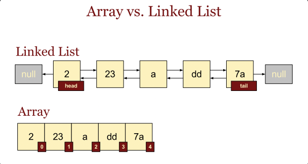
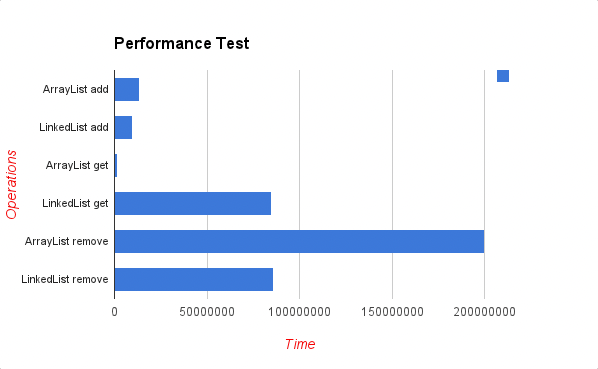

array 와 linkedList

|  | arrayList | linkedList |
| --- | --- | --- |
| get | O(1) | O(n) |
| add | O(1) | O(1) |
| remove | O(n) | O(n) |

arrayList

조회
- arrayList는 index를 가지고 있어 조회를 쉽게 가능

삽입 삭제
- 삭제할 때 맨 앞에 삭제하면 뒤에 있는 것들의 위치를 맞춰줘야함 → 비효율적
- 삽입때도 동일

linkedList

조회
- 순차적으로 접근하기 때문에 검색속도가 느림

삽입과 삭제
- 가리키고 있는 주소값만 변경해주면 되기때문에 효율적

