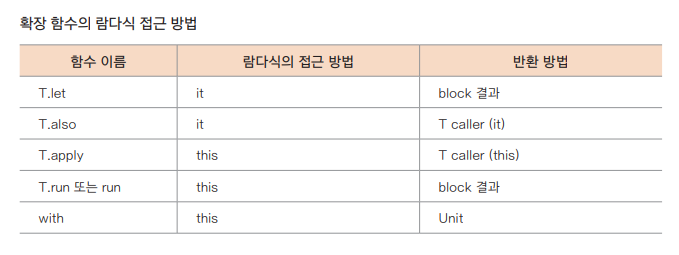

## 코틀린 표준 함수

---

### 람다식과 고차 함수 복습하기
- 람다식
  - 항상 중괄호로 묶여 있으며 중괄호 안에 매개변수는 화살표(->) 왼쪽에 배치되고 오른쪽에는 그에 따른 식을 구성
  - `val 변수 이름: 자료형 선언 = { 매개변수[,...] -> 람다식 본문 }`
  - 특징
    - 매개변수 Int 선언 표현에 의해 타입 추론 가능
    - 매개변수가 1개인 경우, 매개변수를 생략하고 it으로 표현 가능
    - 마지막 표현식이 반환
    - 라벨을 사용해 반환
- 고차 함수
  - 함수의 매개변수로 함수를 받거나 함수 자체를 반환할 수 있는 함수
  - 다양한 형태의 고차 함수 표현법
    - `val result = high("Sean", { x -> inc(x + 3) }) // 함수를 이용한 람다식`
    - `val result2 = high("Sean") { inc(it + 3) } // 소괄호 바깥으로 빼내고 생략`
    - `val result3 = high("Kim", ::inc) // 매개변수 없이 함수의 이름만 사용할 때`
    - `val result4 = high("Sean") { x -> x + 3 } // 람다식 자체를 넘겨준 형태`
    - `val result5 = high("Sean") { it + 3 } // 매개변수가 1개인 경우 생략`

### 클로저
- 클로저(Closure)
  - 람다식으로 표현된 내부 함수에서 외부 범위에 선언된 변수에 접근
  - 기본적으로 함수 안에 정의된 변수는 지역 변수로 스택에 저장되어 있다가 함수가 끝나면 같이 사라짐
  - 클로저 개념에서는 포획한 변수는 참조가 유지되어 함수가 종료되어도 사라지지 않고 함수의 변수에 접근하거나 수정할 수 있음
- 클로저의 조건
  - final 변수를 포획한 경우 변수 값을 람다식과 함께 저장한다
  - final이 아닌 변수를 포획한 경우 변수를 특정 래퍼(wrapper)로 감싸서 나중에 변경하거나 읽을 수 있게 한다. 이때 래퍼에 대한 참조를 람다식과 함께 저장한다
```kotlin
fun main() {
    val calc = Calc()
    var result = 0 // 외부의 변수
    calc.addNum(2,3) { x, y -> result = x + y } // 클로저
    println(result) // 값을 유지하여 5 출력
}

class Calc {
    fun addNum(a: Int, b: Int, add: (Int, Int) -> Unit) { // 람다식 add에는 반환값이 없음
        add(a, b)
    }
}
```

### 코틀린의 표준 라이브러리

> 범위지정함수.md

- use() 함수 활용하기
  - 보통 특정 객체가 사용된 후 닫아야 하는 경우에 사용
  - 객체를 사용한 후 close() 함수를 자동적으로 호출
  - `public inline fun <T : Closeable?, R> T.use(block: (T) -> R): R`
  ```kotlin
  fun main() { 
     PrintWriter(FileOutputStream("d:\\test\\output.txt")).use {
         it.println("hello")
     }
  }
  ```

### 기타 함수의 활용
- takeIf() *(약간 삼항연산자 같음)*
  - 람다식이 true이면 결과를 반환
  - `public inline fun <T> T.takeIf(predicate: (T) -> Boolean): T? = if (predicate(this)) this else null`
  - ex : `input.indexOf(keyword).takeIf { it >= 0 } ?: error("keyword not found")`
- takeUnless()
  - 람다식이 false 이면 결과를 반환
  - ex : `input.indexOf(keyword).takeUnless { it < 0 } ?: error("keyword not found")`
- measureTimeMillis(), measureNanoTime()
  - Long 형 값으로 시간을 얻을 수 있음
- Random.nextInt()
  - 난수 생성
  - 멀티 플랫폼에서도 사용 가능한 kotlin.random.Random 패키지를 제공