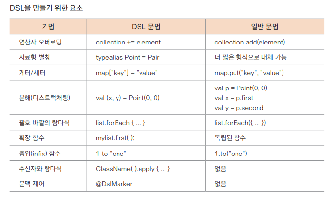

## 람다식과 DSL(Domain-Specific Language)

---

### 코틀린에서 DSL 사용하기
```kotlin
data class Person(
    var name: String? = null,
    var age: Int? = null,
    var job: Job? = null
)

data class Job(
    var category: String? = null,
    var position: String? = null,
    var extension: Int? = null
)

fun person(block: Person.() -> Unit): Person = Person().apply(block)

fun Person.job(block: Job.() -> Unit) {
    job = Job().apply(block)
}

fun main() {
    val person = person { // 간단한 DSL이 적용된 생성 방법
        name = "Kildong"
        age = 40
        job {
            category = "IT"
            position = "Android Developer"
            extension = 1234
        }
    }
    println(person)
}
```


