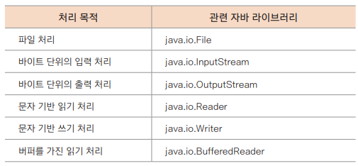
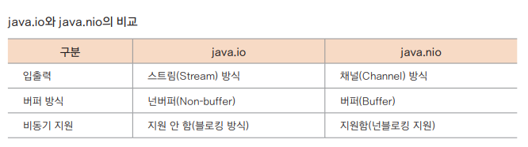
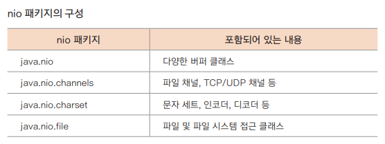
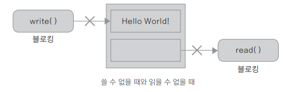

## 파일 입출력

---

### 표준 입출력의 기본 개념

- readList()
```kotlin
fun main() {
    print("Enter: ")
    val input = readLine()!! // String 기본형이기 때문에 !!.toInt() 형태로 호출 가능
    println("You entered: $input")
}
```
- java Scanner 사용 : `val reader = Scanner(System.in) var integer: Int = reader.nextInt() `
- 코틀린 입출력 라이브러리 : https://kotlinlang.org/api/latest/jvm/stdlib/kotlin.io/index.html/


- Kotlin의 입출력 API
  - 표준 라이브러리에서 제공하는 패키지
  
- 자바의 io, nio 개념
  - https://velog.io/@jihoson94/BIO-vs-NIO
  - https://velog.io/@sooyoung159/buffer-stream
  
- 스트림과 채널
  - 스트림(Stream) : 데이터가 흘러가는 방향성에 따라 입력 스트림(InputStream)과 출력 스트림
    (OutputStream)으로 구분 (입출력 별도로 지정 필요)
  - 채널(Channel) : 양방향으로 입력과 출력이 모두 가능하기 때문에 입출력을 별도로 지
    정하지 않아도 된다
  
- 넌퍼버와 버퍼 방식
  - 스트림 방식에서는 1바이트(Byte)를 쓰면 입력 스트림이 1바이트를 읽는다
  - 버퍼를 사용해 다수의 데이터를 읽는 것보다 상당히 느리게 동작
  - io 방식에서는 버퍼와 병합해 사용하는 BufferedInputStream과 BufferedOutputStream을 제공해 사용
  - nio에서는 기본적으로 버퍼를 사용하는 입출력을 하기 때문에 데이터를 일일이 읽는 것보다 더 나은 성능을 보여줌

- 블로킹과 넌블로킹
  - 
  - 블로킹(Blocking)
    - 공간이 비워지거나 채워지기 전까지는 쓰고 읽을 수 없기 때문에 호출한 코드에서 계속 멈춰 있는 것
  - 넌블로킹(Non-blocking)
    - 메인 코드의 흐름을 방해하지 않도록 입출력 작업 시 스레드나 비동기 루틴에 맡겨 별개의 흐름으로 작업하게 되는 것

### 파일에 쓰기
- Files class 정보 : https://docs.oracle.com/javase/7/docs/api/java/nio/file/Files.html/

```kotlin
fun main() {
    val path = "D:\\test\\hello.txt" // 파일을 생성할 경로를 지정
    val text = "안녕하세요! Hello World!\n"
    
    try {
        Files.write(Paths.get(path), text.toByteArray(), StandardOpenOption.CREATE)
    } catch (e: IOException) {
        println(e)
    }
}
```
| 옵션 이름  | 의미                 |
|--------|--------------------|
| READ   | 파일을 읽기용으로 연다       |
| WRITE  | 파일을 쓰기용으로 연다       |
| APPEND | 파일이 존재하면 마지막에 추가한다 |
| CREATE | 파일이 없으면 새 파일을 생성한다 |

- File의 PrintWriter 사용하기

```kotlin
fun main() {
    val outString = "안녕하세요!\tHello\r\nWorld!." // ① 문자열의 구성
    val path = "D:\\test\\testfile.txt"

    val file = File(path)
    val printWriter = PrintWriter(file)

    File(path).printWriter().use { it.println(outString) } // ② 파일에 출력

    // 같은거 1
    // printWriter.println(outString)
    // printWriter.close()

    // 같은거 2
    // File(path).printWriter().use { out -> out.println(outString) }
}
```

- File의 BufferedWriter 이용하기
  - 위에서 `File(path).bufferedWriter().use { it.write(outString) }` 부분으로만 바꿔주면 됨

- File의 writeText() 사용하기
```kotlin
val file= File(path)
file.writeText(outString)
file.appendText("\nDo great work!") // 파일에 문자열을 추가
```

- FileWriter 사용하기
```kotlin
val writer = FileWriter(path, true) // 인자: 경로, append 여부
try {
    writer.write(outString)
} catch (e: Exception) {
   // 오류 발생!
} finally {
    writer.close()
}
```
```kotlin
FileWriter(path, true).use { it.write(outString) }
```

### 파일에서 읽기

- File의 FileReader 사용하기
  - readText()는 내부적으로 StringWriter()를 호출해 텍스트를 메모리로 가져온 후 그 내용을 반환
```kotlin
fun main() {
    val path = "D:\\test\\Over the Rainbow.txt"
 
    try {
        val read = FileReader(path)
        println(read.readText())
    } catch (e: Exception) {
        println(e.message)
    }
}
```