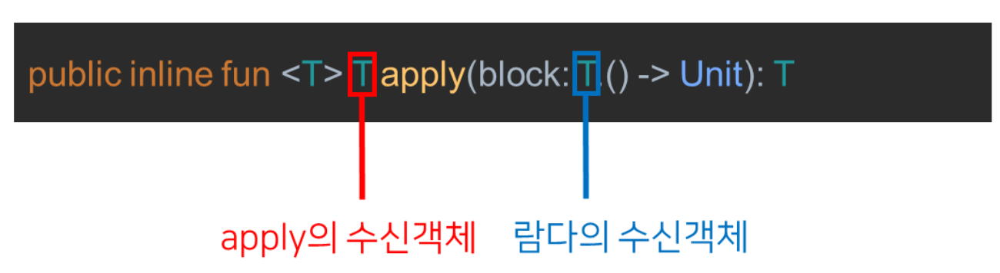
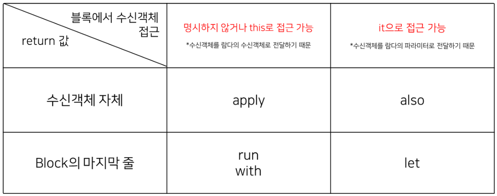
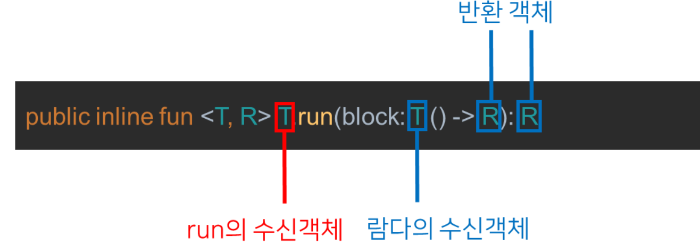
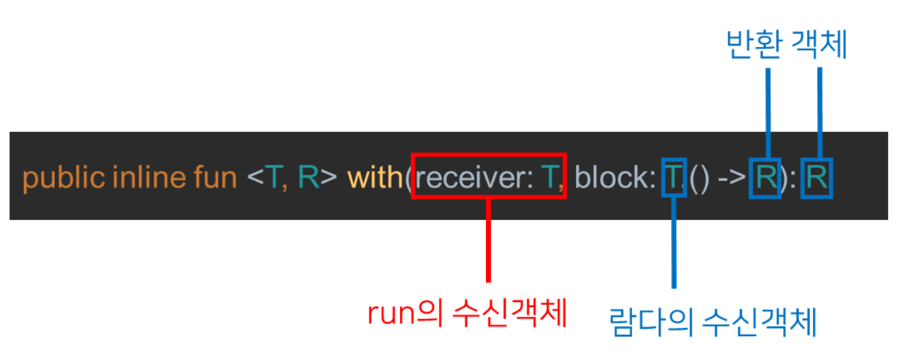

> 범위 지정 함수(Scope function)<br>
> - 특정 객체에 대한 작업을 블록 안에 넣어 실행할 수 있도록 하는 함수
> - 블록은 특정 객체에 대해 할 작업의 범위가 되며, 따라서 범위 지정 함수라고 부른다

코틀린의 범위 지정 함수
1. apply
2. run
3. with
4. let
5. also

### 범위 지정함수와 수신객체 지정 람다(함수)
범위 지정 함수는 다른 말로 수신 객체 지정 람다(함수) 라고도 부른다<br>
이유는 수신 객체를 명시하지 않거나 it을 호출하는 것만으로 람다 안에서 수신 객체의 메서드를 호출할 수 있도록 해주기 때문이다<br>
이것이 가능한 이유는 **블록(block) 람다식에서 수신 객체를 람다의 입력 파라미터 혹은 수신 객체로 사용하였기 때문**이다

- also() 함수는 람다식의 입력 파라미터로 수신 객체(T) 를 지정한다
  
- apply() 함수는 람다식의 수신 객체로 apply의 수신 객체를 지정한다 
  

위 두가지를 활용하면 람다 블록에서 수신객체 지정함수의 수신 객체를 명시하지 않고 접근 가능하거나 it으로 접근할 수 있게 된다


- apply()
  - apply는 수신객체 내부 프로퍼티를 변경한 다음 수신 객체 자체를 반환하기 위해 사용되는 함수
  - `public inline fun <T> T.apply(block: T.() -> Unit): T`


apply를 사용하면 다음의 방법으로 수신객체의 프로퍼티 지정이 가능하다<br>
람다식의 수신 객체가 apply의 수신 객체이기 때문에 수신 객체에 대한 명시를 생략하는 것이 가능하다
```kotlin
val person = Person().apply {
    name = "HONG"
    age = 20
    phoneNumber = "010-1111-1111"
}
```
*안사용하고*
```kotlin
val person = Person()
person.name = "HONG"
person.age = 20
person.phoneNumber = "010-1111-1111"
```

- run()
  - run은 apply와 똑같이 동작하지만 수신 객체를 return하지 않고, run 블록의 마지막 라인을 return하는 범위 지정 함수
  - 수신 객체에 대해 특정한 동작을 수행한 후 결과 값을 리턴 받아야 할 경우 사용
  - `public inline fun <T, R> T.run(block: T.() -> R): R`


```kotlin
data class Person(
    var name: String = "",
    age: Int = 0,
    var temperature: Float = 36.5f
) {
    fun isSick(): Boolean = temperature > 37.5f
}
```
```kotlin
fun main() {
    val person = Person(name = "HONE", age = 29)
    val isPersonSick = person.run {
        temperatur = 37.2f
        isSick()
    }
}
```

- with()
  - with는 수신 객체에 대한 작업 후 마지막 라인을 return
  - run과 완전히 똑같이 동작
  - 다른 점은 run은 확장 함수로 사용되지만 with은 수신 객체를 파라미터로 받아 사용한다
  - `public inline fun <T, R> with(receriver: T, block: T.() -> R): R`


```kotlin
fun main() {
    val person = Person(name = "HONE", age = 29)
    val isPersonSick = with(person) {
        temperatur = 37.2f
        isSick()
    }
}
```

- let()
  - let은 수신 객체를 이용해 작업을 한 후 마지막 줄을 return 할 때 사용
  - run이나 with과는 수신객체를 접근할 때 it을 사용해야한다는 점만 다른다
  - `public inline fun <T, R> T.let(block: (T) -> R): R`
  - 사용
    - null check 후 코드를 실행해야하는 경우
    - nullable한 수신 객체를 다른 타입의 변수로 변환해야하는 경우

```kotlin
fun main() {
    var person: Person? = null
    val isReserved = person?.let { it: Person ->
        reserveMovie(it) 
    }
}
```

- also()
  - also는 apply와 마찬가지로 수신 객체 자신을 반환한다
  - apply가 프로퍼티를 세팅 후 객체 자체를 반환 하는데만 사용된다면, also는 프로퍼티 세팅 뿐만아니라 객체에 대한 추가적인 작업(로깅, 유효성 검사 등)을 한 후 객체를 반환할 때 사용된다
  - `public inline fun <T> T.also(block: (T) -> Unit): T`


- 예시
1. number를 반환받는 함수를 만든 후 해당 number의 숫자를 올리고 싶을 때 다음과 같이 number을 return한 다음 number의 값을 올린다
```kotlin
var person = Person("HONG", 20)

fun getAndIncreaseAge() = age.also {
    person.age = it.age + 1
}

fun main() {
    println("person ${ getAndIncreaseAge() }")
    println("person ${ getAndIncreaseAge() }")
    // person Person(name=HONG, age=21) 
    // person Person(name=HONG, age=22)
}
```
2. 주의할 점은 객체를 사용할 때 객체의 주소값을 return 하는 것이기 때문에 객체의 프로퍼티가 바뀌면 also에서 return 하는 객체의 프로퍼티 또한 바뀐다는 점이다
   - 따라서 객체의 프로퍼티를 다음과 같이 바꾸어 버릴 경우 바뀐 프로퍼티가 객체의 값이 되어 버린다
   - 보통 객체에 대해 같은 용도로 사용하고자 할 때에는 copy를 사용해야한다
   - 그래야 바뀌지 않은 객체가 return 됨을 보장할 수 있다
```kotlin
var person = Person("HONG", 20)

fun getAndIncreaseAge() = age.also {
    person = person.copy(age = it.ate + 1)
}

fun main() {
    println("person ${ getAndIncreaseAge() }")
    println("person ${ getAndIncreaseAge() }")
    // person Person(name=HONG, age=21) 
    // person Person(name=HONG, age=22)
}
```
3. 이러한 문제때문에 also는 거의 사용되지 않고, 사용할 때는 프로퍼티를 바꾸지 않고 동작을 추가적으로 해야하는 경우(로깅 등)에서만 가끔 사용된다
