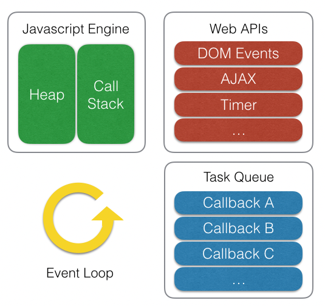

### 이벤트 루프 - javascript와 연관지어서

- 실제로 V8과 같은 자바스크립트 엔진은 단일 호출 스택(Call Stack)을 사용 ⇒ 해당 요청을 순차적으로 호출 스택에 담아 처리
- 동시성 처리 ⇒ 브라우저나 Node.js가 담당



- 비동기 작업을 위해 Node.js의 API를 호출하며, 이때 넘겨진 콜백은 libuv의 이벤트 루프를 통해 스케쥴되고 실행된다.

```kotlin
function delay() {
    for (var i = 0; i < 100000; i++);
}
function foo() {
    delay();
    bar();
    console.log('foo!'); // (3)
}
function bar() {
    delay();
    console.log('bar!'); // (2)
}
function baz() {
    console.log('baz!'); // (4)
}

setTimeout(baz, 10); // (1)
foo();
```

- setTimeout 함수는 브라우저에게 타이머 이벤트를 요청한 후에 바로 스택에서 제거
- foo 함수가 스택에 추가
- foo 함수가 내부적으로 실행하는 함수들이 차례로 스택에 추가되었다가 제거
- foo 함수가 실행을 마치면서 호출 스택이 비워짐

태스크 큐와 이벤트 루프

- 태스크 큐는 말 그대로 콜백 함수들이 대기하는 큐(FIFO) 형태의 배열
- 이벤트 루프는 호출 스택이 비워질 때마다 큐에서 콜백 함수를 꺼내와서 실행하는 역할을 해 준다.

위의 예제를 보면 10ms이 지나면 브라우저의 타이머가 baz를 바로 실행하지 않고 태스크 큐에 추가한다.

⇒ 그러면 현재 실행중인 태스크가 종료되자 마자 태스크 큐에서 대기중인 첫 번째 태스크를 실행

⇒ 이벤트 루프가 태스크 큐에 대기중인 첫 번째 태스크를 호출 스택에 추가하게됨

### 즉 이벤트 루프는 현재 실행중인 태스크의 유무를 반복 확인하는 역할

출처 - https://meetup.toast.com/posts/89