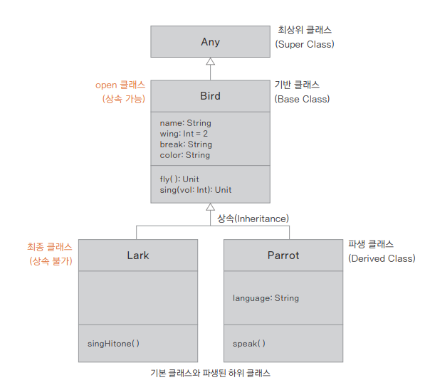

## 상속과 다형성

### 상속과 클래스의 계층

> **자바의 기본 클래스**<br>
> 코틀린과 달리 자바에서는 기본적으로 선언하는 클래스가 상속 가능한 클래스입니다. 자바에서 상속할 수 없는 클래스로 선언하려면 final 키워드를 사용

- 하위 클래스 선언하기
```kotlin
open class 기반 클래스 이름 { // 묵시적으로 Any로부터 상속됨, open으로 파생 가능
    ...
}
class 파생 클래스 이름 : 기반 클래스 이름( ) { // 기반 클래스로부터 상속됨, 최종 클래스로 파생 불가
    ...
}
```
- 파생 클래스 만들어보기
```kotlin
open class BirdChildClasses(var name: String, var wing: Int, var beak: String, var color: String) {
    // 메서드
    fun fly( ) = println("Fly wing: $wing")
    fun sing(vol: Int) = println("Sing vol: $vol")
}

// ② 주 생성자를 사용하는 상속
class Lark(name: String, wing: Int, beak: String, color: String) : BirdChildClasses(name, wing, beak, color) {
    fun singHitone( ) = println("Happy Song!") // 새로 추가한 메서드
}

// ③ 부 생성자를 사용하는 상속
class Parrot : BirdChildClasses {
    val language: String

    constructor(name: String,
        wing: Int,
        beak: String,
        color: String,
        language: String
    ) : super(name, wing, beak, color) {
        this.language = language // 새로 추가한 프로퍼티
    }

    fun speak( ) = println("Speak! $language")
}

fun main( ) {
    val coco = BirdChildClasses("mybird", 2, "short", "blue")
    val lark = Lark("mylark", 2, "long", "brown")
    val parrot = Parrot("myparrot", 2, "short", "multiple", "korean") // 프로퍼티 추가

    println("Coco: ${coco.name}, ${coco.wing}, ${coco.beak}, ${coco.color}")
    println("Lark: ${lark.name}, ${lark.wing}, ${lark.beak}, ${lark.color}")
    println("Parrot: ${parrot.name}, ${parrot.wing}, ${parrot.beak}, ${parrot.color}, ${parrot.language}")

    lark.singHitone( ) // 새로 추가한 메서드 사용 가능
    parrot.speak( )
    lark.fly( )
}
```

### 다형성
- 오버로딩
  - 동일한 클래스 안에서 같은 이름의 메서드가 매개변수만 달리해서 여러 번 정의될 수 있는 개념
- 오버 라이딩
  - 사전적 의미로 '(기존의 작업을) 중단하다', '뒤엎다'
  - 자식 객체가 부모 객체의 함수를 재정의 하는 행동
  ```kotlin
  // 상속 가능한 클래스를 위해 open 사용
  open class BirdOverrideEx(var name: String, var wing: Int, var beak: String, var color: String) {
  
      // 메서드
      fun fly() = println("Fly wing: $wing")
      open fun sing(vol: Int) = println("Sing vol: $vol") // 오버라이딩 가능한 메서드
  }
  
  class OverrideParrot(name: String,
      wing: Int = 2,
      beak: String,
      color: String, // 마지막 인자만 var로 선언되어 프로퍼티가 추가되었음을 알 수 있음
      var language: String = "natural") : BirdOverrideEx(name, wing, beak, color) {
  
      private fun speak() = println("Speak! $language") // Parrot에 추가된 메서드
  
      override fun sing(vol: Int) { // 오버라이딩된 메서드
          println("I'm a parrot! The volume level is $vol")
          speak() // 달라진 내용
      }
  }
  
  fun main( ) {
      val parrot = OverrideParrot(name = "myParrot", beak = "short", color = "multiple")
      parrot.language = "English"
  
      println("Parrot: ${parrot.name}, ${parrot.wing}, ${parrot.beak}, ${parrot.color},${parrot.language}")
      parrot.sing(5) // 달라진 메서드 실행 가능
  }
  ```


