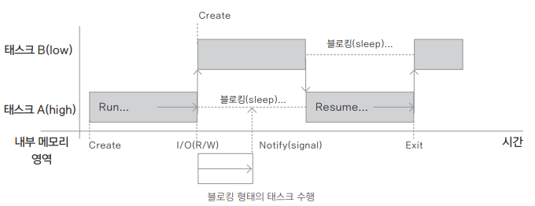

## 동시성 프로그래밍

---

- 동기적(synchronous) 프로그래밍
  - 프로그래밍에서 순서대로 작업을 수행하여 1개의 루틴을 완료한 후 다른 루틴을 실행하는 방식
- 비동기적(asynchronous) 프로그래밍
  - 여러 개의 루틴이 선행 작업의 순서나 완료 여부와 상관없이 실행되는 방식

> **서드파티 라이브러리?**<br>
> 보통 기본으로 제공되는 표준 라이브러리가 아닌 다른 개발자(제3자)가 만든 라이브러리를 말한다
> 개발을 편리하게 해 주는 플러그인, 프레임워크, 유틸리티 API 등을 제공하고 있다

### 블로킹과 넌블로킹
- 블로킹 동작 (직렬)
  
- 논블로킹 동작 (병렬)
  

### 프로세스와 스레드
- 프로세스
  - 하나의 프로그램이 실행되면 프로세스가 시작되는데 프로세스는 실행되는 메모리, 스택, 열린 파일 등을 모두 포함하기 때문에 프로세스 간 문맥 교환(Context-Switching)을 할 때 많은 비용이 든다
- 스레드
  - 자신의 스택만 독립적으로 가지고 나머지는 대부분 스레드끼리 공유하므로 문맥 교환 비용이 낮아 프로그래밍에서 많이 사용된다


- 스레드 생성하기
```kotlin
// ① Thread 클래스를 상속받아 구현하기
class SimpleThread: Thread() {
    override fun run() {
        println("Current Threads: ${currentThread()}")
    }
}

// ② Runnable 인터페이스로부터 run() 메서드 구현하기
class SimpleRunnable: Runnable {
    override fun run() {
        println("Current Threads: ${Thread.currentThread()}")
    }
}

fun main() {
    val thread = SimpleThread()
    thread.start()

    val runnable = SimpleRunnable()
    val thread1 = Thread(runnable)
    thread1.start()
}
```
- 사용자 함수를 통한 스레드 생성하기
```kotlin
// 람다식을 추가로 만들어 실행
fun thread(
    start: Boolean = true,
    isDaemon: Boolean = false,
    contextClassLoader: ClassLoader? = null,
    name: String? = null,
    priority: Int = -1, 
    block: () -> Unit
): Thread {
    val thread = object : Thread() {
        override fun run() {
            block()
        }
    }
    if (isDaemon) thread.isDaemon = true // 백그라운드 실행 여부
    if (priority > 0) thread.priority = priority // 우선순위 (1: 낮음 ~ 5: 보통 ~ 10: 높음)
    name?.let { thread.name = it } // 이름
    if (start) thread.start()
    contextClassLoader?.let { thread.contextClassLoader = it }
    return thread
}

fun main() {
    // 스레드의 옵션 변수를 손쉽게 설정할 수 있음
    thread(start = true) {
        println("Current Threads(Custom function): ${ Thread.currentThread() }")
        println("Priority: ${ Thread.currentThread().priority }") // 기본값은 5
        println("Name: ${ Thread.currentThread().name }")
        println("Name: ${ Thread.currentThread().isDaemon }")
    }
}
```

> **보일러플레이트**<br>
> 보일러플레이트(Boilerplate)한 코드란 반복되어 자주 쓰지만 매번 작성하기 번거롭고 읽기 어려운 많은 양의 코드이다
> 보일러플레이트한 코드를 제거해서 자주 사용되는 루틴을 간략화하는 것이 코틀린의 목표이기도 하다

- 스레드 풀 사용하기
  - 애플리케이션의 비즈니스 로직을 설계할 때는 스레드가 자주 재사용된다
  - newFixedThreadPool()로 스레드를 인자의 수만큼 만들고 작업을 수행할 때 여기에서 재사용 가능한 스레드를 고르게 한다
  - `val myService:ExecutorService = Executors.newFixedThreadPool(8)`
