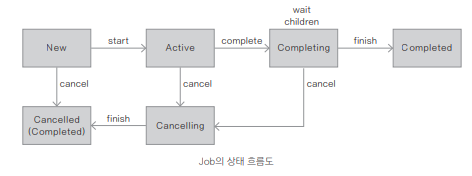

## 코루틴의 개념과 사용방법

---

### 코루틴의 기본 개념
- 코루틴의 주요 패키지

| 기능                             | 설명                                                             |
|--------------------------------|----------------------------------------------------------------|
| launch/async                   | 코루틴 빌더                                                         |
| Job/Deferred                   | cancellation 지원                                                |
| Dispatchers                    | Default는 백그라운드 코루틴을 위한 것이고 Main은 Android나 Swing, JavaFx를 위해 사용 |
| delay/yield                    | 상위 레벨 지연(suspending) 함수                                        |
| Channel / Mutex                | 통신과 동기화를 위한 기능                                                 |
| coroutineScope/supervisorScope | 범위 빌더                                                          |
| select                         | 표현식 지원                                                         |
- core 패키지의 주요 기능

| 기능            | 설명     |
|---------------|--------|
| CommonPool    | 코루틴 문맥 |
| produce/actor | 코루틴 빌더 |


### launch와 async
```kotlin
fun main() { // 메인 스레드의 문맥
    GlobalScope.launch { // 새로운 코루틴을 백그라운드에 실행
        delay(1000L) // 1초의 넌블로킹 지연(시간의 기본 단위는 ms)
        println("World!") // 지연 후 출력
    }

    println("Hello,") // 메인 스레드의 코루틴이 지연되는 동안 계속 실행
    Thread.sleep(2000L) // 메인 스레드가 JVM에서 바로 종료되지 않게 2초 기다림
    
    // Hello,
    // World!
}
```
- delay()는 suspend와 함께 선언된 함수로 코루틴 블록에서 사용할 수 있다
- suspend 키워드는 사용자 함수에서도 사용할 수 있다
- suspend 함수는 사용자가 실행을 일시중단 할 수 있음을 의미하고 코루틴 블록 안에서 사용할 수 있다
- 만약 suspend 함수를 코루틴 블록 외에 사용하면 오류가 터진다

- 이러한 지연 변수는 코루틴 빌더인 launch와 async에서 사용할 수 있지만 메인스레드에서 사용할 수 없다


- launch 코루틴 빌더 생성하기
```kotlin
fun main() {
    val job = GlobalScope.launch { // Job 객체의 반환
        delay(1000L)
        println("World!")
    }

    println("Hello,")
    println("job.isActive: ${ job.isActive }, completed: ${ job.isCompleted }")
    Thread.sleep(2000L)
    println("job.isActive: ${ job.isActive }, completed: ${ job.isCompleted }")
    
    // Hello,
    // job.isActive: true, completed: false
    // World!
    // job.isActive: false, completed: true
}
```
- 코루틴의 순차적 실행
```kotlin
suspend fun doWork1(): String {
    delay(1000)
    return "Work1"
}

suspend fun doWork2(): String {
    delay(3000)
    return "Work2"
}

@DelicateCoroutinesApi
private fun worksInSerial() {
    // 순차적 실행
    GlobalScope.launch {
        val one = doWork1()
        val two = doWork2()
        println("Kotlin One : $one")
        println("Kotlin Two : $two")
    }
}

@DelicateCoroutinesApi
fun main() {
    worksInSerial()
    readLine() // main()이 먼저 종료되는 것을 방지하기 위해 콘솔에서 [Enter]키 입력 대기
}
```
- async 코루틴 빌더 생성하기
```kotlin
private fun worksInParallel() {
    // Deferred<T>를 통해 결괏값을 반환
    val one = GlobalScope.async {
        doWork1()
    }

    val two = GlobalScope.async {
        doWork2()
    }

    GlobalScope.launch {
        val combined = one.await() + "_" + two.await()
        println("Kotlin Combined : $combined")
    }
}
```
- 코루틴의 문맥 // TODO... 뭐라는겨...
  - 코루틴이 실행될 때 여러 가지 문맥은 CoroutineContext에 의해 정의 된다
  - launch { ... } 와 같이 인자가 없는 경우에는 CoroutineScope에서 상위의 문맥이 상속되어 결정
  - launch(Dispatchers.Default) { ... } 와 같이 사용되면 GlobalScope에서 실행되는 문맥과 동일하게 사용
  - GlocalScope는 메인 스레드의 생명 주기가 끝나면 같이 종료된다

- 시작 시점에 대한 속성
  - DEFAULT: 즉시 시작
  - LAZY: 코루틴을 느리게 시작(처음에는 중단된 상태이며 start( )나 await( ) 등으로 시작됨)
  - ATOMIC: 최적화된 방법으로 시작 
  - UNDISPATCHED: 분산 처리 방법으로 시작

- runBlocking 의 사용
  - runBlocking은 새로운 코루틴을 실행하고 완료되기 전까지 현재 스레드를 블로킹한다
  - main()을 블로킹 모드로 동작시키기
  ```kotlin
  fun main() = runBlocking { // main() 함수가 코루틴 환경에서 실행
    launch { // 백그라운드로 코루틴 실행
        delay(1000L)
        println("World!")
    }

    println("Hello") // 즉시 이어서 실행됨
    // delay(2000L) // delay() 함수를 사용하지 않아도 코루틴을 기다림
  }
  ```
  - `suspend fun main() = coroutineScope {` : 코틀린 1.3 부터는 main() 함수에 suspend 지정 가능

- join() 함수의 결과 기다리기
  - 명시적으로 코루틴의 작업이 완료되는 것을 기다리게 하려면 join() 를 사용하면 된다
  - launch에서 반환하는 값은 Job 객체이므로 이것을 이용해 main() 함수에서 join() 함수를 호출할 수 있다
  ```kotlin
  suspend fun main() = coroutineScope {
    val job = launch { // Job 객체 변환
        delay(1000L)
        println("World!")
    }

    println("Hello")
    job.join() // 명시적으로 코루틴이 완료되길 기다림 취소할 경우 job.cancel() 함수를 사용
  }
  ```
> Job 알아보기 
> - Job 이 생성되면 active 상태를 가진다
> - Job() 팩토리 함수에 인자로 CoroutineStart.LAZY로 설정하면 new 상태로 만들어진다
> - Job을 Active 상태로 만들기 위해서는 start()나 join() 함수를 호출
> - job을 취소하려면 cancel() 함수를 사용
> - Job은 Cancelling 상태로 즉시 바뀌고 이후 Cancelled 상태
>  
> - https://kotlin.github.io/kotlinx.coroutines/kotlinx-coroutines-core/kotlinx.coroutines/-job/index.html/

| 상태                | isActive | isCompleted | isCancelled |
|-------------------|----------|-------------|-------------|
| New               | false    | false       | false       |
| Active (기본값 상태)   | true     | false       | false       |
| Completing        | true     | false       | false       |
| Cancelling        | false    | false       | true        |
| Cancelled (최종 상태) | false    | true        | true        |
| Completed (최종 상태) | false    | true        | false       |


- async() 함수의 시작 시점 조절하기
  ```kotlin
  public fun <T> async(context: ..., start: ...CoroutineStart, parent: ...Job?, onCompletion: ...CompletionHandler?, block: suspend ...CoroutineScope.( ) -> T): kotlinx.coroutines.experimental.Deferred<T> { }
  ```
  - start 매개변수를 사용하면 async() 함수의 시작 시점을 조절
  - CoroutineStart.LAZY를 사용하면 코루틴의 함수를 호출하거나 await() 함수를 호출하는 시점에서 async() 함수가 실행되도록 코드를 작성
  ```kotlin
  suspend fun doWork1(): String {
    delay(1000)
    return "Work1"
  }
  
  suspend fun doWork2(): String {
    delay(3000)
    return "Work2"
  }
  
  fun main() = runBlocking {
    val time = measureTimeMillis {
        val one = async(start = CoroutineStart.LAZY) { doWork1() }
        val two = async(start = CoroutineStart.LAZY) { doWork2() }
        
        println("AWAIT: ${ one.await() + "_" + two.await() }")
    }
    println("Completed in $time ms")
  }
  ```

- 많은 작업의 처리
  ```kotlin
  val jobs = List(100_000) { // 많은 양의 코루틴을 위한 List
      launch {
          delay(1000L)
          print(".")
      }
  }
  jobs.forEach { it.join() } // 모든 jobs가 완료될 때가지 기다림
  ```
  - 이런 코드를 스레드로 바꾸면 Out-of-memory 오류가 발생
  - 코루틴으로 작업하면 내부적으로 단 몇 개의 스레드로 수많은 코루틴을 생성해 실행할 수 있기 때문에 오류가 발생하지 않는다
  - 메모리나 실행 속도 면에서 큰 장점
  - 또 다른 방법으로 repeat() 함수를 사용하면 손쉽게 많은 양의 코루틴을 생성 [List(100_000) -> repeat(100_000)]

### 코루틴과 시퀀스
- sequence() 함수를 사용한 피보나치 수열
  ```kotlin
  val fibonacciSeq = sequence {
    var a = 0
    var b = 1

    yield(1) // ① 지연 함수가 사용됨

    while (true) {
        yield(a + b) // ②
        val tmp = a + b
        a = b
        b = tmp
    }
  }
  
  fun main() {
    println(fibonacciSeq.take(8).toList()) // ③ 8개의 값을 획득
  }
  ```
  - 1번의 sequence 블록에서 지연 함수인 yield() 함수를 호출하면서 코루틴을 생성
  - 2번의 while 루프는 매 단계를 무한하게 순회할 때 코루틴에서 다음 수를 계산하도록 실행
  - 3번에서 take().toList()에 의해 무한한 피보나치 수열 중 8개를 List로 변환해 화면상에 출력
  - yield() 함수의 동작 방식
    - 각 표현식을 계속 진행하기 전에 실행을 잠시 멈추고 요소를 반환 (값을 산출 yielding)
    - 멈춘 시점에서 다시 실행을 재개
    - ①번과 ②번은 작업이 일시 중단되었다가 다시 재개되는 부분
    - ③번에서 이렇게 가져온 데이터는 사실 일회성이기 때문에 어딘가에 저장되어 있지 않고 단 한 번 사용
  - yieldAll()
    - `yieldAll(1..5 step 2) // 반복 값 산출`
    - `yieldAll(generateSequence(8) { it * 3 }) // 무한한 시퀀스에서 산출`
    - 반복적으로 멈추게 되면서 특정 범위의 값을 산출
  - 모든 요소는 일회성이기 때문에 각 요소에 대한 다음 요소를 직접 지정하려면 iterator()를 통해 next() 메서드를 사용해야함
    - `val saved = fibonacciSeq.iterator()`
    - `println("${ saved.next() }, ${ saved.next() }, ${ saved.next() }")`
