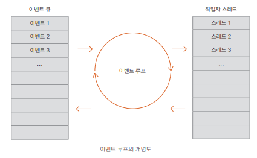

## 공유 데이터 문제 알아보기

---

### 동기화 기법
- **synchronized 메서드와 블록**
  - 스레드 간 서로 공유하는 데이터가 있을 때 동기화해서 데이터의 안전성을 보장한다
  - 특정 스레드가 이미 자원을 사용하는 중이면 나머지 스레드의 접근을 막는 것이다
  - 코틀린에서는 @Synchronized 어노테이션 표기법으로 사용해야한다
  ```kotlin
  @Synchronized fun synchronizedMethod() {
    println("inside: ${ Thread.currentThread() }")
  }
  ```
- **java의 volatile**
  - https://jenkov.com/tutorials/java-concurrency/volatile.html
  - 보통 변수는 성능 때문에 데이터를 캐시에 넣어 두고 작업하는데 이때 여러 스레드로부터 값을 읽거나 쓰면 데이터가 일치하지 않고 깨진다
  - 이것을 방지하기 위해 데이터를 캐시에 넣지 않도록 volatile 키워드와 함께 변수를 선언할 수 있다
  - volatile 키워드를 사용하면 코드가 최적화되면서 순서가 바뀌는 경우도 방지할 수 있다
  - volatile을 사용하면 항상 프로그래머가 의도한 순서대로 읽기 및 쓰기를 수행
  - 그런데 두 스레드에서 공유 변수에 대한 읽기와 쓰기 연산이 있으면 volatile 키워드만으로는 충분하지 않다
  - synchronized를 통해 변수의 읽기 및 쓰기 연산의 원자성(Atomicity)을 보장해 줘야 한다
  - 단, 한 스레드에서 volatile 변수의 값을 읽고 쓰고, 다른 스레드에서는 오직 volatile 변수의 값을 읽기만 할 경우, 읽는 스레드에서는 volatile 변수가 가장 최근에 쓰여졌다는 것을 보장
  ```kotlin
  fun start() {
    running = true
    thread(start = true) {
        while (running) println("${ Thread.currentThread() }, count: ${ count++ }")
    }
  }
    
  fun stop() { running = false }
    
  fun main() {
    start()
    start()
    
    Thread.sleep(10)
    
    stop() // 여기서 상태를 바꿈
  }
  ```
    - 일정 시간이 지난 후 stop() 함수에 의해 running의 상태를 변경하고 start() 함수의 while 조건이 false가 되면서 프로그램이 중단
    - 하지만 @Volatile은 값 쓰기에 대해서는 보장하지 않는다
- **원자 변수**
  - 원자 변수(Atomic Variable)란 특정 변수의 증가나 감소, 더하기나 빼기가 단일 기계어 명령으로 수행되는 것
  - 해당 연산이 수행되는 도중에는 누구도 방해하지 못하기 때문에 값의 무결성을 보장할 수 있음
  - 단일 기계어 명령이란 CPU가 명령을 처리할 때의 최소 단위
  ```kotlin
  // var counter = 0 // 병행 처리 중 문제가 발생할 수 있는 변수
  var counter = AtomicInteger(0) // 원자 변수로 초기화
    
  suspend fun massiveRun(action: suspend () -> Unit) {
    val n = 1000 // 실행할 코루틴의 수
    val k = 1000 // 각 코루틴을 반복할 횟수
    
    val time = measureTimeMillis {
      val jobs = List(n) {
        GlobalScope.launch {
          repeat(k) { action() }
          }
        }
        jobs.forEach { it.join() }
      }
   
      println("Completed ${n * k} actions in $time ms")
    }
    
    fun main() = runBlocking {
      massiveRun {
        // counter++ // 증가 연산 시 값의 무결성에 문제가 발생할 수 있음
        counter.incrementAndGet() // 원자 변수의 멤버 메서드를 사용해 증가
      }
    
      // println("Counter = $counter")
      println("Counter = ${counter.get()}") // 값 읽기
    }
  ```
  - 순차적 프로그램에서는 문제가 없으나 많은 수의 독립적인 루틴이 이 코드에 접근해 counter를 공유하면 언제든 코드가 중단될 수 있음을 생각
  - 중단 시점은 CPU의 최소 단위인 명령어가 실행될 때 결정
  - counter의 증가를 시작했지만 CPU의 최소 명령어가 마무리되지 않은 시점에 루틴이 중단되어서 다른 루틴이 counter를 건드릴 수 있다
- **스레드 가두기**
  - 특정 문맥에서 작동하도록 단일 스레드에 가두는(Thread Confinement) 방법
  ```kotlin
  // 단일 스레드 문맥을 선언
    val counterContext = newSingleThreadContext("CounterContext")
    
    var counter = 0
    
    suspend fun massiveRun(context: CoroutineContext, action: suspend () -> Unit) {
      val n = 1000
      val k = 1000
      val time = measureTimeMillis {
        val jobs = List(n) {
          GlobalScope.launch(context) {
            repeat(k) { action() }
          }
        }
        jobs.forEach { it.join() }
      }
      println("Completed ${ n * k } actions in $time ms")
    }
    
    fun main() = runBlocking<Unit> {
      massiveRun {
        withContext(counterContext) { // 단일 스레드에 가둠
          counter++
        }
      }
    
      println("Counter = $counter")
    }
  ```
  - 실행을 조금 더 빠르게 하기 위해서는 다음과 같이 massiveRun()에 스레드 가두기를 직접 적용
  - 어쨌든 스레드는 문맥상 counter를 독립적으로 가지며 처리하기 때문에 공유 변수 counter의 연산의 무결성을 보장
  - 다만 공간이 필요하므로 좀 느려진다는 점
- **상호 배제**
  - 상호 배제(Mutual Exclusion)는 코드가 임계 구역(Critical Section)에 있는 경우 절대로 동시성이 일어나지 않게 하고 하나의 루틴만 접근하는 것을 보장
  - 임계 구역 또는 공유 변수 영역은 병렬 컴퓨팅에서 둘 이상의 스레드가 동시에 접근해서는 안 되는 배타적 공유 자원의 영역으로 정의
  - 상호 배제의 특징으로 소유자(Owner) 개념이 있는데 일단 잠근 루틴만이 잠금을 해제 할 수 있다
    - val mutex = Mutex()
    - mutex.lock()
    - mutex.unlock()
    ```kotlin
    fun main() = runBlocking<Unit> {
      massiveRun {
        mutex.withLock {
          counter++ // 임계 구역 코드
        }
      }
      println("Counter = $counter")
    }
    ```

### actor 코루틴 빌더
- 코루틴의 결합으로 만든 actor는 코루틴과 채널에서 통신하거나 상태를 관리
- 다른 언어의 actor 개념은 들어오고 나가는 메일 박스 기능과 비슷하지만 코틀린에서는 들어오는 메일 박스 기능만 한다고 볼 수 있다
  -  메일 박스란 특정 연산, 상태, 메시지등을 담아 보내는 것으로 위치에 상관없이 완전히 비동기적으로 수행되도록 디자인된 개념입니다
```kotlin
data class Task (val desc: String)
val me = actor<Task> {
 while(!isClosedForReceive) {
 println(receive().desc.repeat(5))
 }
}
```
- actor는 코루틴이고 순차적으로 실행되며 각 상태는 특정 actor 코루틴에 한정되므로 공유된 변경 가능한 상태에도 문제가 없다
- 이 방법은 lock 기법보다 유용한데 문맥 전환이 없다

### 이벤트 루프

- 항상 이벤트를 기다리며 감시하는 주체 : wait for event
- 이벤트가 발생하면 이것을 처리 : dispatch
> - 이벤트 루프는 각 이벤트 요청에 대한 이벤트 큐를 가지며 이벤트 큐는 이벤트 루프에 의해 처리할 핸들러인 작업자 스레드가 결정되어 실행
> - 이벤트 큐의 실행이 끝나면 이벤트 루프에 의해 다시 이벤트 큐의 위치로 돌아간다
