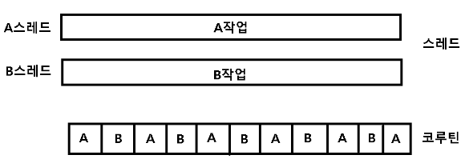

## 스레드와 코루틴의 차이

---

- 스레드
  - A작업과 B작업을 병렬하기 진행함 (A작업을 하면서 B작업을 동시에 진행함)
- 코루틴
  - A작업, B작업을 빠른 속도로 번갈아가며 수행

> 코루틴도 루틴이다. 즉 쓰레드가 아니라 일반 서브루틴과 비슷한 루틴이기 때문에 하나의 쓰레드에 여러개가 존재할 수 있다.

스레드를 설명할 때 일꾼, 생산라인 등에 비유하는 경우가 있는데
위의 경우 스레드는 두 개의 작업을 두 일꾼이 동시에 처리하는 '병렬' 작업이 될 것이고
코루틴은 한 명의 일꾼이 두 작업을 잘게 쪼개서 번갈아 가면서 수행함으로써 동시에 처리되는 것처럼 보이게 하는 것이다

---

- Thread
  - 스레드는 해당 OS의 네이티브 스레드에 직접 연결되어 많은 자원 소모를 일으킨다
  - 스레드간 전환 (Context Switching) 시에도 많은 CPU 소모를 일으킨다
- Coroutine
  - 네이티브 리소스를 사용하지 않고 가장 간단한 경우 JVM Heep에서 비교적 작은 객체 하나만 사용
  - 코루틴간 전환시에는 OS 커널을 포함하지 않아서 일반 함수를 호출하는 것 처럼 저렴 하다(오버헤드 없음)

