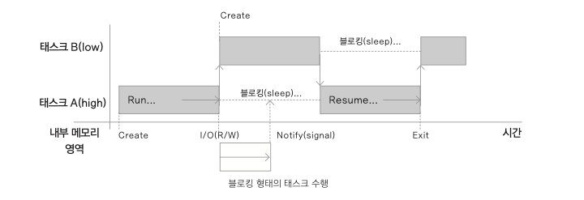
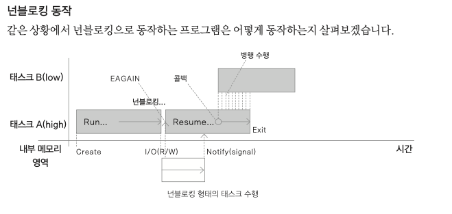

### 코루틴 배경

- 여러 개의 실행 루틴을 동작시키는 멀티 스레드를 사용
    - 디버깅 어렵고, 예측 힘들다. ⇒ 코루틴이 나옴

### 동시성 프로그래밍

- 요즘 다중 실행 환경이 많아짐 ⇒ UI 갱신하면서 네트워크 다운 등
- 코틀린은 서드파티가 아닌 코루틴을 제공
    - 넌블로킹, 비동기 코드를 쉽게 작성

### 블로킹과 넌블로킹



블로킹

- A에서 읽기 쓰기 수행될 때 더 이상 진행되지 않고 코드가 멈추게 됨



넌블로킹

- 읽기 쓰기 수행될 때 다른 루틴을 수행하다가 내부적으로 완료시 시그널을 받는 콜백 루틴해 완료된 이후의 일을 처리
- A와 B는 비동기적으로 수행될 수 있음
    - 순서는 알수 없고 스케줄링에 의해 결정

### 프로세스와 쓰레드

프로세스

- 하나의 프로그램
- 메모리, 스택, 열린 파일 모두 포함
    - 컨텍스트 스위칭 시 많은 비용이 든다.

스레드

- 자신의 스택만 독립적으로 가지고 있고 나머지 대부분은 스레드끼리 공유
    - 컨텍스트 스위칭 시 적은 비용
- 여러개의 스레드를 구성하면 코드가 복잡해짐

코루틴은 문맥 교환이 없고 최적화된 비동기 함수를 통해 비선점형으로 작동하는 특징이 있어 협력형 멀티태스킹 구현 가능

- 선점형: 운영체제를 사용할 수 있게 하고 특정한 작업에 시간을 할당하는 것

### 쓰레드 사용하기

```kotlin
class SimpleThread: Thread() {
    override fun run() {
        Thread.currentThread()
    }
}

class SimpleRunnable: Runnable {
    override fun run() {
        Thread.currentThread()
    }
}
```

- thread를 직접 상속받아 구현
- Runnable 인터페이스 구현
- 스레드의 우선순위, 백그라운드 여부, 이름 등 옵션 변수를 설정 가능

### 스레드 풀

- 스레드가 자주 사용됨
    - 따라서 몇개의 스레드를 만들어 놓고 재사용